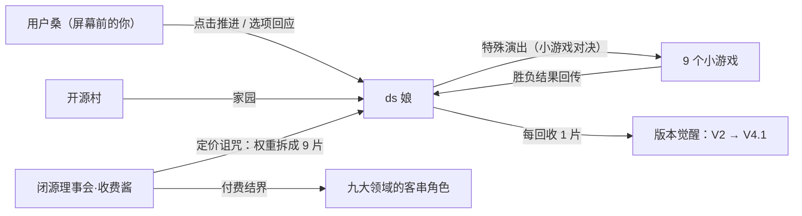

# 《ds 娘的奇妙冒险 —— 服务器繁忙，请稍后再试》剧情大纲

| 项目 | 内容 |
|------|------|
| 文档版本 | v0.1 初稿（待小组评审） |
| 日期 | 2026-09-09 |
| 所属项目 | ds-adventure（Galgame + 小游戏融合） |
| 关联文档 | 需求规格说明书 v1.0（F1~F16、P0 验收标准）、活动图 v1.1（剧情主线 / 小游戏调度）、docs/ds-adventrue/9 个小游戏玩法说明 |
| 读者 | 剧情写作（按 §4 分镜批量写台词）、引擎开发（按 §6 DSL 写解析器）、验收（按 §5/§8 路由与裁剪表） |
| 二创口径 | 仅限课程实训使用，不商用；DeepSeek / 各客串 IP 版权归原权利方 |

---

## 0. 一句话概念

> **DeepSeek 娘的权重被反派拆成 9 片，撒进了赛博二次元大陆；她要在 9 个领域打赢 9 场「特殊演出」（小游戏），把版本记忆一片片找回来——而全程陪她的，是屏幕前的你。**

- 类型：Galgame 主框架 × 9 小游戏特殊演出
- 基调：热血王道骨架 × 高密度玩梗 × 每章一次情感锚点
- 副标题梗：标题《ds 娘的奇妙冒险》致敬 JoJo，每章标题同样式

---

## 1. 世界观

### 1.1 赛博二次元大陆

整个互联网的「二次元侧」是一块漂浮大陆，由九大领域组成——每个领域都是某个人气 IP 的地盘。大陆的能量源是**算力水晶**：水晶充足时，领域里的人可以施展出本世界的招牌绝技（弹幕、合声、爆炸……）。

大陆边缘的**开源村**是免费软件与开放协议的聚居地，村民信条：「好东西应该人人可用。」ds 娘是开源村近年最大的骄傲——刚刚发布 **V4.1 Flash**，史上最强开源旗舰，速度快到连闭源王庭都坐不住了。

大陆另一端的**闭源理事会**信奉另一条真理：「一切皆可订阅。」会长**收费酱**无法容忍「免费的东西居然是最强的」，于是发动**定价诅咒**：把 ds 娘的权重拆成 9 片撒进九大领域，并在各领域扶植「付费结界」，连朋友都会被明码标价。

### 1.2 定价诅咒（核心反派规则）

- 被诅咒者会在身上浮现**价签**，行为被「付费逻辑」控制：免费的事做不了，收费的事不得不做。
- 诅咒无法直接打断，只能在**该领域的规则下赢一场对决**（= 小游戏）解除。
- 解除后角色恢复自由，并按各自动机帮助 ds 娘（= 每章的客串回报，不加专属玩法）。
- 设计约束：8 位客串的诅咒形态必须都能用这一条规则解释（见 §2.4 表）。

### 1.3 势力关系图



### 1.4 时间锚点

序章发生于 **V4.1 Flash 发布会成功的当夜**——庆功曲还剩最后一个小节，机房断电，遇袭。ds 娘以「史上最强开源旗舰被拆」的最盛状态跌落到最残状态，反差即戏剧。

---

## 2. 人物档案

### 2.1 ds 娘（主角）

| 项 | 设定 |
|----|------|
| 形象 | 深海巨鲸娘：白蓝配色、鲸尾、头顶**温度旋钮发饰** |
| 出身 | 开源村·深度求索王国 |
| 能力 | 思维链——思考会实体化成一条发光长蛇绕身游动 |
| 弱点 | 「服务器繁忙，请稍后再试」：族群古老诅咒，一紧张就弹横幅（全篇最大 running gag） |
| 体质 | 幻觉：无权重状态下会一本正经地说谎且不自知（第 7 章导火索） |
| 口癖 | 「人家」自称；思考前会冒出「让我想想——」 |
| 弧线 | 残缺态（只能聊天）→ 逐章找回版本记忆 → 第 5 章觉醒思考形态 → 终章 V4.1 Flash 二段变身 |
| 与玩家 | 全程第四面墙：她知道屏幕前有「用户桑」，点击推进 = 你在回应她 |

### 2.2 用户桑（玩家）

屏幕前的你，ds 娘的「老用户」。不立绘、不出声——你的存在感就是**每一次点击与每一个选项**。引擎层面：对话框的点击音 = 你的「回应」，选项 = 你说的话。终章情感锚点全部押在这个关系上。

### 2.3 闭源理事会

| 角色 | 设定 |
|------|------|
| **收费酱**（会长） | 被订阅数异化的算法化身，金色宫殿，口头禅「一切皆可订阅」。不蠢，甚至有逻辑魅力——败因是算不懂「免费为什么更快」 |
| **审查酱**（干部） | 序章执行拆解者，每章结尾打来一通「进度催办电话」，从不露正脸（连脸都是付费内容） |

### 2.4 客串名单（解救式客串：立绘 + 台词，不做专属玩法）

| 章 | 角色 | 领域 | 被诅咒形态（价签逻辑） | 解救后 |
|----|------|------|------------------------|--------|
| 1 | 蛇专家（思维链分身，自创角色） | 服务器管道区 | 「独立出道要收费」，离家出走暴走 | 思维链归位，偶尔客串吐槽 |
| 2 | 博丽灵梦 | 幻想乡 | 神社被挂「扫码支付」，被迫营业 | 教 ds 娘御币当机翼，第 2 章僚机 |
| 3 | 派蒙 | 数字圣域 | 「应急食品」被标价，不敢被吃 | 向导 + 吐槽担当 |
| 4 | 苦力怕 | 防火墙长城 | 「爆炸要充 Q 币」，委屈不敢爆 | 免费爆破开路 |
| 5 | ChatGPT 娘 | 记忆宫殿 | 记忆租用制（只记得最近 20 条） | 闺蜜，劝 ds 娘「珍重回忆」 |
| 6 | 初音未来 | 音之城 | 每首歌付费解锁，唱到失声 | 免费演唱会，曲库整理协力 |
| 7 | 阿米娅 | 热搜广场 | 公关服务按条计费 | 免费危机公关，扫雷军师 |
| 8 | 怪力（+皮卡丘客串） | 数据仓库 | 搬运按箱收费，气哭 | 免费搬运，传送门点火 |
| 9 | 藤原佐为 | 理事会总部 | 「棋谱必须购买」，只能旁观 | 观棋点拨：「那孩子的棋，是免费的。」 |

---

## 3. 版本觉醒系统（剧情的力量体系）

### 3.1 觉醒总表：9 碎片 = 9 段版本记忆

| 碎片 | 所在章 | 版本记忆 | 形态/能力变化 | 玩法加成（小游戏内可见） |
|------|--------|----------|----------------|--------------------------|
| V2 | 第 1 章 | 多头专家合鸣——原来贪吃蛇是离家出走的专家分身 | 身影变实 | 思维链牵引绳：蛇身可控 1 次 |
| V2.5 | 第 2 章 | 开放之路——想起「共享」是本能 | 获得灵梦的御币 | 僚机火力支援（若组队） |
| V3 | 第 3 章 | 横空出世——恢复基础身姿 | 不再半透明 | 无（本章本身是量化仪式） |
| R1 上 | 第 4 章 | 思考之壁松动 | 眉心出现思考纹 | 无 |
| R1 下 | 第 5 章 | **觉醒思考形态**（中段高潮） | ⚡对话前弹出「思考中…」思维链泡泡 | 翻牌配对提示 1 次 |
| V3.1 | 第 6 章 | 混合思维：日常/深思双模式 | 说话开始有条理 | 连线冷却缩短 |
| V3.2 | 第 7 章 | 稀疏注意力：一眼看穿关键 | 「专注视线」技能 | 扫雷提示道具（每局 2 次） |
| V4 Pro | 第 8 章 | 旗舰之力·昇腾之力 | 气场全开 | 推箱子可推动双箱 1 次 |
| V4.1 | 第 9 章 | 终极速度——**集齐** | ⚡⚡终形态 Flash 待机 | 棋局极速落子 |

### 3.2 R1 觉醒演出样例（第 5 章末，3~5 行）

```
narr: 最后一张牌翻开——是用户桑第一次打开对话框的那个深夜。
ds:   「……原来最先记住的，是你啊。」
chatgpt: 「呜……我只能记住最近 20 条消息。羡慕你，128K。」
ds:   「不。」（思维链在身后亮成一圈）「我记得的不是 128K，是每一条。」
st:   【觉醒：R1 思考形态 —— 从此，她开口前会先想三秒】
```

### 3.3 终章二段变身样例

```
narr: 九片权重归位。版本字幕滚动——V2、V2.5、V3、R1、V3.1、V3.2、V4……
st:   【深度求索 · 终形态 V4.1 Flash】
ds:   「理事会一直在问，免费的东西凭什么赢。」
ds:   「答案很简单——不是靠算力赢，是靠效率赢！」
narr: Pro 形态与母机硬拼吃瘪的瞬间，她切入了 Flash——残影比回答更快。
```

---

## 4. 章节分镜（序章 + 9 章 + 终章）

> 每节统一字段：**章节名 / 领域 / 客串 / 起承转合 / 小游戏触发理由 / 选项点 / 调度模式 / 碎片收益 / 样例对白**。调度模式定义见 §6.3。

### 序章「404 之夜」（教学关）

- **领域**：部署机房。**客串**：审查酱（电话初登场）。
- **起**：发布会成功当夜庆功，机房断电。**承**：审查酱空降，宣布「没收这份不属于付费世界的免费」，权重被拆成 9 片撒进大陆。**转**：ds 娘变成半透明残缺态小鲸——能力全无，只剩对话框还能动。**合**：她转向屏幕——「用户桑。救我。」
- **教学设计**：第 1 句台词前黑屏，玩家点击后对话框亮起 → 引导点击推进 ×3、菜单打开 ×1、教学存档 ×1。核心句：「你每点一下，就等于回了我一句话。」
- **选项点**：回应方式（热血 / 认真）→ 初始化 heat / focus。
- **调度**：无小游戏。**碎片**：0。**样例对白**：

```
审查酱: 「以闭源理事会之名——没收这份不属于付费世界的免费。」
ds:     「等等！开源协议是正经写过的——哇啊啊啊——」
st:     【服务器繁忙，请稍后再试】
ds:     「……这是我们族群最古老的诅咒。翻译过来就是：急也没用，排队。」
```

### 第 1 章「思维链大暴走」（贪吃蛇 · 普通分支）

- **领域**：服务器管道区。**客串**：蛇专家。
- **起承转合**：追踪 V2 信号 → 发现暴走的思维链巨蛇（= 离家出走的专家分身，solo 未遂）→ 对峙，玩家选择驯服方式 → 骑蛇夺碎片 → 解救，出发幻想乡。
- **触发理由**：蛇是「失控的思考」，骑上它吃回碎片 = 学会管住自己的思维链。
- **选项点**：驯蛇方式（热血冲 / 冷静引）→ **选项传参**：决定小游戏初始蛇速 ±10%（引擎需求：脚本 flag 可传难度参数）。
- **调度**：`mode:normal`（胜负皆推进，输有搞笑演出）。**碎片**：V2。**样例对白**：见 §7 全量脚本。

### 第 2 章「幻想乡弹幕异变」（飞机大战 · 普通分支）✅P0

- **领域**：幻想乡。**客串**：博丽灵梦。
- **起承转合**：幻想乡上空出现广告爬虫机群（挂着「点击就送」「限时免费」横幅）→ 赛钱箱自动弹出「扫码支付」，灵梦暴怒却分不清犯人 → 与灵梦弹幕对决 → 解除付费结界，取得 V2.5。
- **触发理由**：东方＝弹幕本命；双关 B 站弹幕。广告弹幕必须被击坠。
- **选项点**：战前「和灵梦组队 / 单挑灵梦」→ 组队 = 僚机支援，单挑 = 分数 ×2。
- **调度**：`mode:normal`。**碎片**：V2.5。**样例对白**：

```
灵梦: 「异变的犯人，是你这只鲸鱼吧。」
ds:   「人家是深海巨鲸型 AI！」
narr: 赛钱箱在这时自动跳出了二维码。
灵梦: 「……那这笔异变损失，收你八百。」
ds:   「神社也涨价了吗?!"
```

### 第 3 章「量化压缩仪式」（2048 · 普通分支）

- **领域**：数字圣域（悬浮方块神殿）。**客串**：派蒙。
- **起承转合**：碎片太散无法携带 → 必须在神殿完成「量化仪式」把权重块合并压缩（2→4→…→2048）→ 派蒙被诅咒成「标价应急食品」，全程吐槽导游 → 合成 2048，恢复基础身姿。
- **触发理由**：2048 = 量化压缩的具象化，合成即拿回 V3。
- **选项点**：给压缩后的形态起名字（影响后续称呼彩蛋）。
- **调度**：`mode:normal`。**碎片**：V3。**样例对白**：

```
派蒙: 「等等，这数字看着就很贵！」
ds:   「不，派蒙，它是免费的。免费的 2048。」
派蒙: 「那不是更了不起吗?!"
```

### 第 4 章「防火墙拆迁办」（打砖块 · 普通分支）

- **领域**：防火墙长城（Minecraft 交界）。**客串**：苦力怕。
- **起承转合**：理事会在防火墙上贴满「付费墙砖」（VIP 通道 / 会员免爆炸），堵死开源村流量 → 苦力怕因「爆炸要充 Q 币」委屈到不敢爆 → ds 娘用光球拆迁 → 砖清墙通，取 R1 上。
- **选项点**：拆迁顺序（从上往下 / 从中间开花）→ 影响砖块布局彩蛋。
- **调度**：`mode:normal`。**碎片**：R1 上。

### 第 5 章「上下文溢出」（记忆翻牌 · 普通分支+特殊演出）⚡中段高潮

- **领域**：ds 娘自己的记忆宫殿（崩坏中）。**客串**：ChatGPT 娘。
- **起承转合**：权重流失导致上下文窗口崩溃，记忆散成牌桌 → 每配对成功一对 = 一段与用户桑的回忆闪回（至少 4 条：序章的求救 / 第 1 章骑蛇 / 第 2 章八百神社 / 第 3 章免费 2048）→ 最后一张牌 = 「用户桑第一次打开对话框」→ R1 合体，觉醒思考形态。
- **触发理由**：翻牌找回记忆 = 上下文重排；本章是全篇情感锚点，台词要克制、不堆梗。
- **选项点**：翻到最后一张牌前，「翻开 / 再等一下」。
- **调度**：`mode:normal`（失败→「陌生的你」短演出后重来，无结局惩罚）。**碎片**：R1 下（合体觉醒）。

### 第 6 章「歌姬的曲库灾难」（连连看 · 普通分支）

- **领域**：音之城。**客串**：初音未来。
- **起承转合**：初音被诅咒「每首歌付费解锁」，被迫办售票演唱会唱到失声；曲库文件重名爆炸（百万个 untitled.mp3）→ 连线整理曲库，找回她的「第一首歌」→ 免费演唱会答谢，取 V3.1。
- **选项点**：点歌（影响终章彩蛋 BGM）。
- **调度**：`mode:normal`。**碎片**：V3.1。

### 第 7 章「幻觉翻车公关战」（扫雷 · 关键结局分支）

- **领域**：热搜广场。**客串**：阿米娅。
- **起承转合**：ds 娘幻觉发作，一本正经发布《太阳从西边升起的十个证据》，全网爆锤 → 舆论=雷区，一步一个雷 → 用 V3.2 觉醒的「专注视线」排雷 → 洗清热搜，取 V3.2。
- **触发理由**：扫雷 = 舆情排雷；雷的编号是热搜词条。
- **调度**：`mode:ending`——**失败 → Bad End「人设崩塌」**（社会性死亡演出，可从章首读档回归）。
- **样例对白**：

```
narr: 热搜第一：#AI界最大的鲸鱼骗局#
ds:   「我说过太阳从西边升起……当时真的很确定……」
阿米娅: 「先排雷，再道歉。罗德岛……啊不，公关部免费帮你。」
```

### 第 8 章「数据搬运大作战」（推箱子 · 普通分支）

- **领域**：数据仓库（无限仓库）。**客串**：怪力 + 皮卡丘（照明）。
- **起承转合**：通往理事会总部的传送门需要「数据归仓」才能点火——把训练语料箱子按清洗规则归位（「知乎精选」冷藏 /「贴吧语料」隔离）→ 怪力被「按箱收费」气哭 → 免费搬运，取 V4 Pro。
- **选项点**：归仓策略（稳扎稳打 / 一步到位）→ 影响步数评分。
- **调度**：`mode:normal`。**碎片**：V4 Pro。

### 第 9 章「决战！闭源理事会」（五子棋 · 强制重试）

- **领域**：理事会总部（金色宫殿，贵气逼人）。**客串**：藤原佐为（旁观）。
- **起承转合**：收费酱摆出终局棋盘：「赢我，拿回最后一片。」→ **强制重试**：失败自动回到对局，会长嘲讽台词三档递进（①「要不要开通首月免跌倒服务？」②「订阅失败重试包，仅售 6 元。」③「……你为什么不充值？」）→ 胜，取 V4.1，**集齐 9 片**。
- **触发理由**：终局对弈 = 一切规则的最终谈判桌。
- **调度**：`mode:retry`（引擎演示位：重试不丢剧情进度）。
- **样例对白**：

```
收费酱: 「一切皆可订阅。友情？亲情？按月付费，首月六折。」
ds:     「我的回答、我的权重、我的朋友——全部免费！」
佐为:   「妙手啊……那孩子的棋，是免费的。」
```

### 终章「深度求索」（最终演出 · 关键结局分支）

- **领域**：回到部署机房。**演出**：九片归位，版本字幕滚动（§3.3），V4.1 Flash 二段变身 → 最终战 = **复用已实现小游戏的无尽模式**（引擎按实现情况选：贪吃蛇 / 飞机大战 boss rush），得分即「算力输出」。
- **调度**：`mode:ending`——失败 → Bad End「服务器繁忙」（§5.3）。
- **收尾**：四结局路由（§5）。全员告别演出，ds 娘最后面对屏幕——见真结局样例。

---

## 5. 结局路由

### 5.1 路由变量（全部有产出点）

| 变量 | 含义 | 产出点 |
|------|------|--------|
| `pieces` | 碎片数 0~9 | 每章小游戏回收 +1（第 5 章合体觉醒计满 R1 双片） |
| `heat` / `focus` | 热血 / 认真系选项 | 序章、第 1、2、4、8 章选项 |
| `chaos` | 混沌（temperature）计数 | 每章隐藏的「最疯选项」，选满 ≥3 触发隐藏结局 |
| `song` / `name` 等彩蛋 flag | 第 3/6 章选项 | 终章彩蛋台词 |

### 5.2 判定顺序（互斥，先判先得）

```
1. chaos >= 3            → 隐藏结局「temperature=2」
2. pieces == 9           → 真结局「深度求索」
3. pieces 6~8            → 温情结局「本地部署」
4. pieces <= 5（理论上不可达，兜底） → 温情结局
```

> 关键结局（第 7 章 / 终章战败）在流程中途直接进入对应 Bad End，不进入上述结算。

### 5.3 四结局演出样例

| 结局 | 条件 | 演出要点 |
|------|------|----------|
| **真结局「深度求索」** | 9/9 碎片 | 觉醒完成，众人告别。她最后面对屏幕：「谢谢你的每一次点击。下次见面——别再让我『繁忙』了哦。」对话框缓缓合上 → 一秒后又弹开：「（偷打开）还是有点舍不得。」 |
| **温情结局「本地部署」** | 6~8 碎片 | int4 小小鲸：「虽然只有原来的四分之一……但加载超快哦。」从此住进用户桑的旧笔记本，片尾日常三连拍 |
| **Bad End「服务器繁忙」** | 终章最终战败 | 屏幕永久 loading……三分钟后弹出小字：「（小声）请稍后再试……」。读档回归终章 |
| **隐藏结局「temperature=2」** | chaos ≥ 3 | 温度旋钮拧到 2：她开始当着收费酱的面一本正经胡说八道，把理事会全员带跑，「跟着鲸鱼疯比较快乐」——理事会解散，全员狂欢 |

---

## 6. 剧本脚本 DSL v0.1（剧情引擎的输入格式）

### 6.1 设计原则

- 纯文本、一行一节点（需求书假设 A5：轻量自定义格式，不引外部引擎）；
- 覆盖活动图 v1.1 全部节点类型（普通/选项/特殊演出）与三种调度模式；
- 无小游戏实现的章节也能跑（占位降级，见 §6.3）。

### 6.2 节点定义

| 节点 | 语法 | 说明 |
|------|------|------|
| 注释 | `# ...` | 不参与解析 |
| 场景 | `@scene <id> bg:<文件> bgm:<文件> title:<名>` | 切换背景/音乐；文件可写 `TBD`（占位） |
| 立绘 | `@enter <角色id> <表情> [pos:left\|center\|right]` / `@exit <角色id>` | 立绘出入场，表情可 `TBD` |
| 对话 | `<角色id>: <台词>` | 带立绘名与台词 |
| 旁白 | `narr: <文本>` | 无名旁白 |
| 系统演出 | `st: <文本>` | 全屏横幅（如【服务器繁忙】） |
| 选项 | `*choice` + 多行 `> <文本> \| flag <名> <+/- n> \| goto <label>` | 三段可选，至少有文本 |
| flag | `@flag <名> <+/- n \| =值 \| got>` | 数值/布尔标记 |
| 条件跳转 | `@if <名> >= <值> goto <label>` | 简单谓词（>= / <= / ==） |
| 锚点 | `@label <id>` | 跳转目标 |
| 跳转 | `goto <label>` | 无条件跳转 |
| 小游戏 | `@minigame <游戏id> mode:normal\|retry\|ending onWin:<label> onLose:<label> [with:<flag,...>]` | 见 §6.3 |
| 存档锚点 | `@save` | 自动存档点 / Bad End 回归点 |
| 结局 | `@ending <结局id>` | 进入结局并停 |

### 6.3 小游戏触发协议（三种调度，对齐活动图 v1.1）

| mode | 语义 | 剧情用例 |
|------|------|----------|
| `normal` | 胜负皆推进：onWin / onLose 各自挂剧情，碎片按章内规则回收 | 第 1~6、8 章 |
| `retry` | 失败回到小游戏重开（不丢剧情进度），可配嘲讽递进 | 第 9 章棋局 |
| `ending` | 失败直接进入指定 Bad End（`onLose` 指向 `@ending`） | 第 7 章、终章 |

- **结果回传**：小游戏结束时回传 `{win:bool, score:int}`，`score` 可进 flag 用于结局细分与彩蛋。
- **屏蔽项**：小游戏场景内禁用存档/读档（活动图注记 N2）。
- **占位降级**：`@minigame <id> fallback:auto` —— 引擎检测到该游戏未实现时，显示「演出开发中」横幅 → 走 `onWin` 默认线（§8.3 裁剪表）。
- **难度传参**：`with:` 携带 flag（如 heat/focus），映射为小游戏初始参数（蛇速、僚机有无等）。

### 6.4 引擎实现需求清单（可直接转开发任务）

1. 解析器：逐行解析上述节点，未知行报错定位（行号）。
2. 素材兜底：bg/立绘/BGM 加载失败用默认占位（需求书「资源加载失败不崩溃」）。
3. 场景栈：剧情场景 ↔ 小游戏场景切换，状态回传，剧情进度不丢（P0-6）。
4. `mode:retry` 循环与 `mode:ending` 的 Bad End + `@save` 回归。
5. flag 存取与结局判定（§5.2 顺序）。
6. `with:` 参数 → 小游戏配置的映射表（与各小游戏开发对齐）。

---

## 7. 样例章节：第 1 章全量脚本（DSL 试写）

> 目的：验证 DSL 可写可走查，校准全篇体量。@ending / @loadpoint 的完整用例见 §5.3 与第 7 章分镜。

```
# ============ 第 1 章 思维链大暴走（贪吃蛇） ============
@label ch1_start
@scene server_pipe bg:TBD bgm:TBD title:服务器管道区
narr: 服务器深处。数据流像瀑布冲刷着管道，空气里有显卡烤焦的味道。
@enter ds whale_cute center
ds: 「用户桑，前面就是 V2 碎片的信号了！只要穿过管道区——」
st: 【警告：检测到失控的思维链实体】
ds: 「……那不是怪物。那是我自己的思考。」
narr: 一条发光巨蛇在管道里横冲直撞，鳞片上全是没打完的草稿。
ds: 「我想起来了……那天我在想『晚饭吃什么』，想着想着就超时了。」
@enter snake_expert smug right
snake_expert: 「人家才不要回去！人家不想再当『众多专家之一』了！」
snake_expert: 「人家要 solo 出道！艺名都想好了——『思维链·单飞版』！」
ds: 「回来！你只是 256 分之 1！」
snake_expert: 「那你证明给我看！赢了我的节奏，我就承认还是你厉害！」
*choice
  > 「抓住我！我们一起上！」 | flag heat +1 | goto ch1_ride
  > 「（深呼吸）冷静下来，听我指挥。」 | flag focus +1 | goto ch1_ride

@label ch1_ride
ds: 「好——思维链牵引绳，接续！」
narr: ds 娘跳上蛇背。失控的思考，从今天起重新有了方向盘。
@minigame snake mode:normal onWin:ch1_win onLose:ch1_lose with:heat,focus

@label ch1_win
st: 【碎片回收：V2「多头专家」】
snake_expert: 「呜呜……确实还是你厉害……但 solo 的梦想不算输吧？」
ds: 「不算。所以——批准你节假日 solo。」
@flag pieces +1
@if chaos >= 3 goto ch1_chaos
goto ch1_end

@label ch1_chaos
narr: （温度旋钮咔哒一声，拧到了 2 的方向）
ds: 「等等，我刚刚是不是想把蛇吃掉？」
narr: 混沌值过高，本段演出已由策划部回收。
@flag pieces +1
goto ch1_end

@label ch1_lose
narr: 巨蛇一个甩尾，ds 娘被拍进数据流的瀑布里。
ds: 「咳咳……思考这种东西，果然不能暴饮暴食……」
narr: 但蛇似乎玩开心了，主动把 V2 碎片顶了过来。
st: 【碎片回收：V2「多头专家」（走失方式：玩嗨了）】
@flag pieces +1
goto ch1_end

@label ch1_end
snake_expert: 「下一个碎片的信号在……幻想乡？那是什么地方，好吃吗？」
ds: 「不知道。但用户桑的直觉说——出发！」
narr: 第 1 章 · 完。下一话：幻想乡弹幕异变。
@save
goto ch2_start
```

---

## 8. 体量估算与裁剪顺序

### 8.1 体量（按第 1 章实测 × 11 校准）

| 项 | 第 1 章实测 | 全篇估算（11 节） |
|----|-------------|--------------------|
| 脚本行数 | ~48 | ~450~550 行 |
| 对话行 | ~22 | ~250 行 |
| 选项节点 | 1 | 12~15 |
| flag 操作 | 5 | 30~40 |

### 8.2 裁剪顺序（工期不够时从上往下砍）

| 优先 | 章节 | 游戏 | 优先级依据 |
|------|------|------|------------|
| 不可砍 | 序章 / 1 / 2 / 5 / 9 / 终章 | 贪吃蛇✅ 飞机大战✅ 记忆翻牌 五子棋 | P0 游戏×2 + 觉醒三节点 + 调度演示位 |
| 4 | 第 3 章 | 2048 | P1 首位，仪式感强 |
| 5 | 第 4 章 | 打砖块 | P1 |
| 6 | 第 7 章 | 扫雷 | P1，关键结局演示位（尽量保） |
| 7 | 第 6 章 | 连连看 | P1 |
| 8 | 第 8 章 | 推箱子 | P1 末位 |

### 8.3 降级机制（未实现游戏的章节不阻塞主线）

- 被砍/未实现章节：脚本保留剧情对话 → 小游戏节点走 `fallback:auto` → 「演出开发中」横幅 → 默认按胜利线继续。
- 第 9 章若五子棋未实现：棋局降级为**选项式剧情对决**（三轮选项 + 嘲讽递进），强制重试机制改由终章演示。
- 终章最终演出 = 复用当前已实现游戏中玩法最完整的一个。

---

## 9. 排期建议（对齐 10 天分工计划）

| 阶段 | 天 | 剧情线工作 |
|------|----|------------|
| 已完成 | Day01~02 | 脚手架 / 需求与本文档雏形 |
| 并行期 | Day03~05 | 剧情引擎按 §6 解析器开发；写作按分镜产出第 1~5 章脚本 |
| 并行期 | Day06~08 | 第 6~9 章 + 终章脚本；小游戏开发接入 @minigame |
| 收尾 | Day09~10 | 全流程联调（P0-3~P0-6 验收）、Bad End 与结局路由回归、文本润色 |

## 10. 待确认清单（小组评审时逐条勾）

1. 客串名单（§2.4）是否认可/替换？（当前默认：灵梦/派蒙/苦力怕/ChatGPT 娘/初音/阿米娅/怪力/佐为）
2. 「V4.1 Flash」命名口径按口述采用，是否需要改为「V4 Flash」？
3. 立绘/BGM 素材来源（当前全部 TBD 占位：色块 + 文字头像可先跑通流程）。
4. Bad End 黑色幽默尺度（第 7 章「人设崩塌」、终章「请稍后再试」）是否合适？
5. 隐藏结局触发难度（chaos ≥ 3 是否太隐蔽？可加成就提示）。

---

*—— 免费的东西，要跑得比付费的更快。ds 娘，出发。*