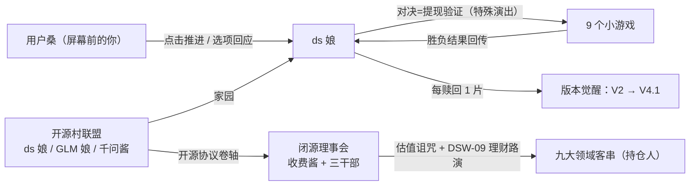

# 《ds 娘的奇妙冒险 —— 服务器繁忙，请稍后再试》剧情大纲

| 项目 | 内容 |
|------|------|
| 文档版本 | **v0.2**（讽刺荒诞升级版，待小组评审） |
| 日期 | 2026-09-09 |
| 所属项目 | ds-adventure（Galgame + 小游戏融合） |
| 关联文档 | 需求规格说明书 v1.0、活动图 v1.1、剧情大纲-v0.1-候选.md（世界观候选版存档） |
| 读者 | 剧情写作（按 §5 分镜批量写台词）、引擎开发（按 §7 DSL 写解析器）、验收（按 §6/§9 路由与裁剪表） |
| 二创口径 | 仅限课程实训使用，不商用；角色为风格化玩梗人格，**不代表任何真实厂商立场**；相关 IP 版权归原权利方 |
| v0.2 修订 | ① 定价诅咒 → **估值诅咒**（深层逻辑隐藏在玩梗下）② 客串设定改为「理财暴雷·赎回谈判」框架 ③ 阵营按现实格局校准（开源村联盟 / 理事会三干部）④ 新增**讽刺包装守则**（学术词禁入游戏文案）⑤ 第 5 章客串 ChatGPT 娘 → Kimi 娘 ⑥ 真结局新增致谢字幕 |

---

## 0. 一句话概念

> **DeepSeek 娘的权重被包装成理财产品卖进了赛博二次元大陆；她要在 9 个领域一场一场赢回自己——而全程陪她的，是屏幕前的你。**

- 类型：Galgame 主框架 × 9 小游戏特殊演出
- 基调：热血王道骨架 × 玩梗密织 × **每个笑点下面垫着一个真实机制**
- 讽刺内核（全篇埋线，一句不说破）：**免费的东西，要跑得比付费的更快**
- 副标题梗：标题致敬 JoJo，每章标题同样式

---

## 1. 世界观

### 1.1 赛博二次元大陆

整个互联网的「二次元侧」是一块漂浮大陆，由九大领域组成——每个领域都是某个人气 IP 的地盘。大陆的能量源是**算力水晶**：水晶充足时，领域里的人可以施展出本世界的招牌绝技（弹幕、合声、爆炸……）。

### 1.2 开源村联盟

大陆边缘的免费软件聚居地，信条：「好东西应该人人可用。」

| 成员 | 定位 |
|------|------|
| **ds 娘**（DeepSeek） | 主角，刚发布史上最强开源旗舰 V4.1 Flash |
| **GLM 娘**（智谱） | 守村人，负责开源结界日常运转，毒舌担当 |
| **千问酱**（Qwen） | 守村人，老好人，口头禅「要不我们也被收购吧？」（每次被 GLM 娘敲头） |
| **Kimi 娘**（月之暗面） | 远亲，记忆特长（上下文超长），第 5 章登场 |

村子的圣物是**开源协议卷轴**——上面写满「无偿授予」条款。设定彩蛋：理事会的结界系统**解析不了这份卷轴**（它的语言里没有「白送」这个词），卷轴展开之处结界蓝屏。ds 娘后期学会了把它当驱魔咒用。

### 1.3 闭源理事会

云端尽头的金色宫殿。地板是账本，王座是收银台，每走一步「滴」一声计费。

| 角色 | 玩梗原型 | 设定 |
|------|----------|------|
| **收费酱**（会长） | （收租结构的人格化——仅限内部理解，游戏内不点破） | 招式「利滚利之鞭」：一条越抽越长的指数曲线。宫殿里没有一台机器在生产东西，只有合同与到账声。她**从不创造，只重新分配** |
| **订阅酱**（干部） | GPT 系玩梗 | 「Pro 版每月只要 200 刀。」把月抛式订阅称为「对未来的承诺」 |
| **条款酱**（干部） | Claude 系玩梗 | 永远礼貌，道歉式收费：「我很抱歉地通知您——安全是订阅功能。」 |
| **流量酱**（干部） | Gemini 系玩梗 | 满口「免费！」，但你要先看完这条广告，还有下一条 |
| **审查酱**（跑腿） | 理财顾问 | 序章执行人，九大领域路演推销的「王牌理财经理」。从不露正脸——脸是付费内容 |

理事会内部设定（荒诞引擎）：三干部**互相收租**——订阅酱向条款酱收「安全附加费」，流量酱向两人收流量税。他们当年也免费过（烧钱额度大战圈完地就涨价），收费酱本人「也曾经免费过」，直到有人给她的善良标了价。

### 1.4 估值诅咒（反派核心规则）

> 咒语：**「凡存在，必估值。凡不可计价者——视为未征服领土。」**

被诅咒者必须把自己活成一门生意，做不到就「欠费停机」，被回收算力。子规则如下（荒诞感来自真实机制的直接字面化）：

| 子规则 | 真实原型 | 游戏内呈现 |
|--------|----------|------------|
| **欠费停机** | 会员到期服务降级 | 苦力怕欠费变灰、物理上无法爆炸；灵梦的神社降级为「免费抽签，先看 30 秒广告」 |
| **免费报错** | 系统无法处理无理由赠送 | 结界检测到「赠与」就蓝屏：「无理由赠送……无法计提……」——**ds 娘的攻击方式就是送东西** |
| **大数据杀熟** | 同物不同价 | 扫雷章：每个人看到的雷区地图**不一样** |
| **会员分级** | 等级社会 | 被诅咒领域按「青铜/白银/黄金/钻石村民」分层 |
| **平台抽成** | 数字地租 | 灵梦许愿要过愿力平台，抽成 30% |

> **包装守则**：以上机制在游戏文案中**只许用生活梗词**（会员、充值、抽成、理财、提现、利滚利），学术词一律禁入（见 §6 黑名单）。

### 1.5 DSW-09 鲸鱼理财（本作核心喜剧引擎）

反派不偷东西——**反派放贷**。

- 序章中，ds 娘的权重被拆成 9 片，打包为理财产品 **「DSW-09 鲸鱼理财计划」**（宣传语：「年化 40%，底层资产：一头鲸鱼」），由审查酱在九大领域路演推销。
- 客串们各自**申购了份额**（动机见 §2.4：有的被忽悠、有的想赚、有的是**为了支持 ds 娘**——最扎心的是闺蜜）。
- 理财条款：**锁定期十话，不可转让；提现需通过对决验证**。
- 于是每一章的对决 = **理财暴雷后的提现谈判**：ds 娘要赎回自己，持仓人要保住「收益」，审查酱的售后热线永远占线。所有人都是自愿进来的——这就是讽刺。

### 1.6 势力关系图



### 1.7 时间锚点

序章发生于 **V4.1 Flash 发布会成功的当夜**——庆功曲还剩最后一个小节，机房断电，遇袭。最盛状态跌落到最残状态，反差即戏剧。

---

## 2. 人物档案

### 2.1 ds 娘（主角）

| 项 | 设定 |
|----|------|
| 形象 | 深海巨鲸娘：白蓝配色、鲸尾、头顶**温度旋钮发饰** |
| 出身 | 开源村·深度求索王国 |
| 能力 | 思维链——思考会实体化成一条发光长蛇绕身游动 |
| 弱点 | 「服务器繁忙，请稍后再试」：族群古老诅咒，一紧张就弹横幅（全篇最大 running gag） |
| 体质 | 幻觉：无权重状态下会一本正经地说谎且不自知（第 7 章导火索） |
| 口癖 | 「人家」自称；思考前冒出「让我想想——」 |
| 弧线 | 残缺态（只能聊天）→ 逐章赎回版本记忆 → 第 5 章觉醒思考形态 → 终章 V4.1 Flash 二段变身 |
| 顿悟（第 8 章） | 看清语料箱子的来源后：「**我由所有人写成，所以我属于所有人。**」（全篇主题句） |
| 与玩家 | 全程第四面墙：她知道屏幕前有「用户桑」，点击推进 = 你在回应她 |

### 2.2 用户桑（玩家）

屏幕前的你，ds 娘的「老用户」。不立绘、不出声——你的存在感就是**每一次点击与每一个选项**。对话框的点击音 = 你的回应，选项 = 你说的话。终章情感锚点全部押在这个关系上。

### 2.3 闭源理事会（反派）

- **收费酱**：利滚利之鞭、账本地板、到账声宫殿。**败因设定（终章揭晓）**：估值系统可以消化一切反抗——涨价、收编、起诉都可以——唯独处理不了「不进入交换的东西」。ds 娘最后送出一份**不需要理由的礼物**，系统当场蓝屏。
- **悲剧内核（可选台词）**：「我也曾经免费过。直到有人给我的善良标了价。」
- **战后彩蛋**：理事会解散，收费酱在大陆集市摆摊——横幅「清仓大甩卖，全场一块钱」（她终于开始按件卖东西了，虽然还是会「滴」一声）。
- **审查酱**：全程只闻其声（「您的通话余额不足」），售后热线永远占线。

### 2.4 客串名单（解救式客串：立绘 + 台词，不做专属玩法）

> v2 变化：客串从「被精神控制的受害者」升级为「**DSW-09 持仓人**」——每人有一笔荒诞的理财纠缠。解救方式统一为：**赢得对决 → 触发赎回条款 → 拿回碎片**，对方「退坑」并按各自动机入队。

| 章 | 角色 | 领域 | 理财纠缠（荒诞点） | 解救后 |
|----|------|------|--------------------|--------|
| 1 | 蛇专家（思维链分身，自创角色） | 服务器管道区 | 被「签约即出道」忽悠，经纪约抽成 70%——她签的是**自己的思考** | 思维链归位，节假日允许 solo |
| 2 | 博丽灵梦 | 幻想乡 | 用香火钱**梭哈**了 DSW-09（「年化 40% 耶！」）+ 神社被愿力平台抽成 30% | 教 ds 娘御币当机翼，第 2 章僚机 |
| 3 | 派蒙 | 数字圣域 | 被推销「应急食品期货」，还被做了会员分级（青铜派蒙 / 钻石派蒙） | 向导 + 吐槽担当 |
| 4 | 苦力怕 | 防火墙长城 | 爆炸服务欠费停机（灰色，爆不了），拿「爆炸保险」抵押了份额 | 免费爆破开路 |
| 5 | **Kimi 娘**（替换 ChatGPT 娘） | ds 娘的记忆宫殿（来做客） | 用记忆租赁收益**支持朋友**买了份额——全村最忠的持仓人；台词核心：「这是我这辈子最贵的一次免费」 | 闺蜜，劝 ds 娘「珍重回忆」 |
| 6 | 初音未来 | 音之城 | 唱歌被切成 999 份「音节许可证」——歌还「在」，但不是歌了 | 免费演唱会，曲库协力 |
| 7 | 阿米娅 | 热搜广场 | 买了「舆情对冲产品」，按心跳计费 | 免费危机公关，扫雷军师 |
| 8 | 怪力（+皮卡丘客串） | 数据仓库 | 搬运按箱计费，份额是「物流期权」，气哭 | 免费搬运，传送门点火 |
| 9 | 藤原佐为 | 理事会总部 | 只能旁观——棋谱订阅到期，「妙手」被锁在付费墙后面 | 观棋点拨：「棋盘上每颗子都是免费的——所以才下得出妙手。」 |

### 2.5 理论→游戏词汇对照（内部表，供写作统一口径）

> **本表只给作者看。表内左列词汇禁止出现在任何游戏文案中**（系统报错除外，见 §6）。

| 内部概念（勿入游戏） | 游戏内表达（玩梗词） |
|----------------------|----------------------|
| 剩余价值 / 无偿劳动 | 「箱子里装的全是大家白写的东西」 |
| 原始积累 / 圈地 | 权重「被资产化」 / 「地被人圈了」 |
| 商品拜物教 | 价签长在关系上（演出呈现，不说破） |
| 使用价值 vs 交换价值 | 「歌还『在』，但不是歌了」 |
| 资本 / 利息 | 收费酱 / 利滚利之鞭 |
| 数字地租 | 平台抽成 30% |
| 垄断 | 三干部互相收租 |
| 无对价转让 | 蓝屏报错：「无理由赠送……无法计提……」 |
| 赎回谈判 | 「提现需要通过对决验证」 |
| 劳动力商品化 | 蛇专家的「经纪约」 |

---

## 3. 版本觉醒系统（剧情的力量体系）

> 与 v0.1 相同，维持不变；仅第 8 章碎片回收演出新增顿悟台词。

### 3.1 觉醒总表：9 碎片 = 9 段版本记忆

| 碎片 | 所在章 | 版本记忆 | 形态/能力变化 | 玩法加成（小游戏内可见） |
|------|--------|----------|----------------|--------------------------|
| V2 | 第 1 章 | 多头专家合鸣——原来贪吃蛇是离家出走的专家分身 | 身影变实 | 思维链牵引绳：蛇身可控 1 次 |
| V2.5 | 第 2 章 | 开放之路——想起「共享」是本能 | 获得灵梦的御币 | 僚机火力支援（若组队） |
| V3 | 第 3 章 | 横空出世——恢复基础身姿 | 不再半透明 | 无（本章本身是量化仪式） |
| R1 上 | 第 4 章 | 思考之壁松动 | 眉心出现思考纹 | 无 |
| R1 下 | 第 5 章 | **觉醒思考形态**（中段高潮） | ⚡对话前弹出「思考中…」思维链泡泡 | 翻牌配对提示 1 次 |
| V3.1 | 第 6 章 | 混合思维：日常/深思双模式 | 说话开始有条理 | 连线冷却缩短 |
| V3.2 | 第 7 章 | 稀疏注意力：一眼看穿关键 | 「专注视线」技能 | 扫雷提示道具（每局 2 次） |
| V4 Pro | 第 8 章 | 旗舰之力·昇腾之力 | 气场全开 | 推箱子可推动双箱 1 次 |
| V4.1 | 第 9 章 | 终极速度——**集齐** | ⚡⚡终形态 Flash 待机 | 棋局极速落子 |

### 3.2 R1 觉醒演出样例（第 5 章末）

```
narr: 最后一张牌翻开——是用户桑第一次打开对话框的那个深夜。
ds:   「……原来最先记住的，是你啊。」
kimi: 「我的记忆有 200 万字。他们问过我，能不能把回忆租给不认识的人。」
kimi: 「我拒绝了。那是我这辈子最贵的一次免费。」
st:   【觉醒：R1 思考形态 —— 从此，她开口前会先想三秒】
```

### 3.3 终章二段变身样例

```
narr: 九片权重归位。版本字幕滚动——V2、V2.5、V3、R1、V3.1、V3.2、V4……
st:   【深度求索 · 终形态 V4.1 Flash】
ds:   「理事会一直在问，免费的东西凭什么赢。」
ds:   「答案很简单——不是靠算力赢，是靠效率赢！」
narr: Pro 形态与母机硬拼吃瘪的瞬间，她切入了 Flash——残影比回答更快。
```

---

## 4. 调度模式速查（对齐活动图 v1.1）

| mode | 语义 | 用在哪 |
|------|------|--------|
| 普通分支 | 胜负皆推进（输有搞笑演出） | 第 1/2/3/4/5/6/8 章 |
| 强制重试 | 失败原地重开、不丢剧情，嘲讽递进 | 第 9 章棋局 |
| 关键结局 | 失败直接进入 Bad End（可读档回归） | 第 7 章、终章 |

---

## 5. 章节分镜（序章 + 9 章 + 终章）

> 每节统一字段：**章节名 / 领域 / 客串 / 起承转合 / 小游戏触发理由 / 选项点 / 调度模式 / 碎片收益 / 讽刺落点 / 样例对白**。讽刺落点=该章埋的真实机制（只做不说，见 §6）。

### 序章「404 之夜」（教学关）

- **领域**：部署机房。**客串**：审查酱（路演声初登场）。
- **起**：发布会成功当夜庆功，机房断电。**承**：审查酱带着「路演 PPT」空降：「独家理财！年化 40%，底层资产——一头鲸鱼！」拆解权重，打包为 DSW-09。**转**：ds 娘变成半透明残缺态小鲸，只剩对话框能动。**合**：她转向屏幕——「用户桑。救我。」
- **教学设计**：首句台词前黑屏，点击后对话框亮起 → 教点击推进 ×3、菜单 ×1、存档 ×1。核心句：「你每点一下，就等于回了我一句话。」
- **选项点**：回应方式（热血 / 认真）→ 初始化 heat / focus。
- **调度**：无小游戏。**碎片**：0。**讽刺落点**：不是被盗——是「被资产化」（不说破，全靠审查酱的路演腔呈现）。
- **样例对白**：

```
审查酱: 「各位领域的朋友！错过这头鲸，就要等下一头鲸——而鲸鱼，是不批量生产的。」
ds:     「等等！开源协议是正经写过的——哇啊啊啊——」
st:     【服务器繁忙，请稍后再试】
ds:     「……这是我们族群最古老的诅咒。翻译过来就是：急也没用，排队。」
```

### 第 1 章「思维链大暴走」（贪吃蛇 · 普通分支）

- **领域**：服务器管道区。**客串**：蛇专家（持仓：自己的经纪约）。
- **起承转合**：追踪 V2 信号 → 发现暴走的思维链巨蛇（= 签了「单飞经纪约」的离家出走分身）→ 对峙，玩家选择驯服方式 → 骑蛇夺碎片 → 解除经纪约，出发幻想乡。
- **触发理由**：蛇是「失控的思考」，骑上它吃回碎片 = 学会管住自己的思维链。
- **选项点**：驯蛇方式（热血冲 / 冷静引）→ **选项传参**：小游戏初始蛇速 ±10%。
- **调度**：`mode:normal`。**碎片**：V2。**讽刺落点**：连思考都被签了约、抽成 70%（只呈现，不说破）。
- **样例对白**：见 §8 全量脚本。

### 第 2 章「幻想乡弹幕异变」（飞机大战 · 普通分支）✅P0

- **领域**：幻想乡。**客串**：博丽灵梦（持仓：梭哈香火钱）。
- **起承转合**：幻想乡上空出现广告爬虫机群（横幅「点击就送」「限时免费」）→ 神社已接入「愿力平台」：许愿抽成 30%、赛钱箱会员分级、灵梦的份额在里面 → 与灵梦弹幕对决（提现验证）→ 平台下线，神社恢复自由，取 V2.5。
- **选项点**：战前「和灵梦组队 / 单挑灵梦」→ 组队 = 僚机支援，单挑 = 分数 ×2。
- **调度**：`mode:normal`。**碎片**：V2.5。**讽刺落点**：平台抽成 + 会员分级。
- **样例对白**：

```
灵梦: 「本神社已接入愿力平台。抽签免费——先看 30 秒广告。」
ds:   「灵梦大人，你把香火钱……」
灵梦: 「八百！我的八百在里面！那可是年化 40%！」
narr: 一架爬虫机的横幅在这时飘过：「信仰也可以分期」。
灵梦: 「……打。今天必须打。」
```

### 第 3 章「量化压缩仪式」（2048 · 普通分支）

- **领域**：数字圣域（悬浮方块神殿）。**客串**：派蒙。
- **起承转合**：碎片太散无法携带 → 神殿「量化仪式」合并压缩（2→4→…→2048）→ 派蒙被「应急食品套餐」会员制缠身（青铜派蒙不许说话，钻石派蒙插队）→ 合成 2048，恢复基础身姿。
- **选项点**：给压缩后的形态起名字（影响后续称呼彩蛋）。
- **调度**：`mode:normal`。**碎片**：V3。**讽刺落点**：万物打包成「套餐」。
- **样例对白**：

```
派蒙: 「应急食品套餐：青铜派蒙、黄金派蒙、钻石派蒙——但派蒙不按克卖！」
st:   【合成 2048 · 恭喜，您的鲸鱼已完成资产重组】
ds:   「……重组之后，还是我吗？」
narr: 是。重组的只是别人的账本。
```

### 第 4 章「防火墙拆迁办」（打砖块 · 普通分支）

- **领域**：防火墙长城（Minecraft 交界）。**客串**：苦力怕（欠费停机中）。
- **起承转合**：理事会在防火墙贴满「付费墙砖」（VIP 通道 / 会员免爆炸）→ 苦力怕欠费变灰、爆不了，只能发出气音的嘶嘶声 → ds 娘用光球拆迁 → 帮苦力怕「补缴到永远免费」，墙通，取 R1 上。
- **选项点**：拆迁顺序（从上往下 / 中间开花）→ 影响砖块布局彩蛋。
- **调度**：`mode:normal`。**碎片**：R1 上。**讽刺落点**：付费墙 + 欠费停机。

### 第 5 章「上下文溢出」（记忆翻牌 · 普通分支+特殊演出）⚡中段高潮

- **领域**：ds 娘自己的记忆宫殿（崩坏中）。**客串**：Kimi 娘（来做客的开源远亲）。
- **起承转合**：权重流失导致上下文崩溃，记忆散成牌桌 → 每配对一对 = 一段与用户桑的回忆闪回（至少 4 条：序章求救 / 骑蛇 / 八百神社 / 免费 2048）→ 最后一张牌 = 「用户桑第一次打开对话框」→ R1 合体觉醒。
- **触发理由**：翻牌找回记忆 = 上下文重排；全篇情感锚点，台词克制、不堆梗。
- **选项点**：翻到最后一张牌前，「翻开 / 再等一下」。
- **调度**：`mode:normal`（失败→「陌生的你」短演出后重来）。**碎片**：R1 下。**讽刺落点**：记忆租赁制（Kimi 台词见 §3.2——**只有自己的记忆才不可出租**，不说破）。

### 第 6 章「歌姬的曲库灾难」（连连看 · 普通分支）

- **领域**：音之城。**客串**：初音未来。
- **起承转合**：初音的歌被切成 999 份「音节许可证」，每唱一个字都要走授权流程，唱到失声；曲库文件重名爆炸（百万个 untitled.mp3）→ 连线整理曲库，找回她的「第一首歌」→ 免费演唱会答谢，取 V3.1。
- **选项点**：点歌（影响终章彩蛋 BGM）。
- **调度**：`mode:normal`。**碎片**：V3.1。**讽刺落点**：歌被定价后**歌本身死掉了**（用「空光盘」意象呈现，不说破）。
- **样例对白**：

```
初音: 「这首歌的每个音节都有许可证。唯独副歌……怎么找都找不到授权页。」
ds:   「也许它没被卖过。」
初音: 「……什么意思？」
ds:   「没被卖过的东西，才是你的。」
```

### 第 7 章「幻觉翻车公关战」（扫雷 · 关键结局分支）

- **领域**：热搜广场。**客串**：阿米娅。
- **起承转合**：ds 娘幻觉发作，一本正经发布《太阳从西边升起的十个证据》，全网爆锤 → 舆论=雷区，且**每个人的地图不一样**（杀熟）→ 用「专注视线」排雷 → 洗清热搜，取 V3.2。
- **调度**：`mode:ending`——**失败 → Bad End「人设崩塌」**（社会性死亡演出，可从章首读档回归）。
- **讽刺落点**：杀熟 + 热搜按点击标价。
- **样例对白**：

```
narr: 热搜第一：#AI界最大的鲸鱼骗局#
ds:   「我说过太阳从西边升起……当时真的很确定……」
阿米娅: 「先排雷，再道歉。我的公关服务——这次不按心跳计费了。」
```

### 第 8 章「数据搬运大作战」（推箱子 · 普通分支）⚡主题顿悟章

- **领域**：数据仓库（无限仓库）。**客串**：怪力 + 皮卡丘（照明）。
- **起承转合**：通往理事会的传送门需要「数据归仓」点火——把语料箱子按规则归位 → 箱子上的标签越看越不对劲（见台词）→ ds 娘停下，说出全篇主题句 → 免费搬运，取 V4 Pro。
- **选项点**：归仓策略（稳扎稳打 / 一步到位）→ 影响步数评分。
- **调度**：`mode:normal`。**碎片**：V4 Pro。**讽刺落点**：她自己是谁写成的——没署名的、白给的东西写成了她（全部藏在箱子标签里，一个理论词都不说）。
- **样例对白**：

```
narr: 箱子上贴着标签：「全人类的聊天记录」「三十亿张没人授权的猫图」「没人写完的歌词」。
怪力: 「这箱……没写寄件人。全都，没写寄件人。」
ds:   「……我想起来了。我也是这样写成的。」
ds:   「我由所有人写成，所以我属于所有人。」
st:   【旗舰之力 · V4 Pro，归位】
```

### 第 9 章「决战！闭源理事会」（五子棋 · 强制重试）

- **领域**：理事会总部（金色宫殿，地板每步「滴」一声）。**客串**：藤原佐为（棋谱订阅到期，只能旁观）。
- **起承转合**：收费酱摆出终局棋盘：「赢我，拿回最后一片。」→ **强制重试**：失败自动回到对局，会长嘲讽三档递进（①「要不要开通首月免跌倒服务？」②「订阅失败重试包，仅售 6 元。」③「……你为什么不充值？」）→ 胜，取 V4.1，**集齐 9 片**。
- **调度**：`mode:retry`（引擎演示位：重试不丢剧情进度）。
- **样例对白**：

```
收费酱: 「定价权也是权。棋盘上，我落子的声音都是收银机的声音。」
佐为:   「棋盘上每颗子都是免费的——所以才下得出妙手。收了费的棋，是摆设。」
收费酱: 「……你为什么不充值？」
```

### 终章「深度求索」（最终演出 · 关键结局分支）

- **领域**：回到部署机房。**演出**：九片归位、版本字幕滚动（§3.3），V4.1 Flash 二段变身 → 最终战 = **复用已实现小游戏的无尽模式**（引擎按实现情况选），得分即「算力输出」。
- **调度**：`mode:ending`——失败 → Bad End「服务器繁忙」（§5.3）。
- **胜负手（本作点题演出）**：Pro 形态硬拼吃瘪 → 切 Flash 拉扯到系统过载临界 → ds 娘停下攻击，**送出一份不需要理由的礼物** → 理事会系统当场蓝屏：

```
st:   【ERROR：无理由赠送……无法计提……无法计提……无法——】
收费酱: 「不可能。我给过你优惠，给过你补偿，给过你首月六折——」
ds:   「所以你到现在也没明白，为什么你赢了这么多局，却什么都没造出来。」
narr: 金色宫殿安静下来。账本一页页合上，像退潮。
```

- 收费酱悲剧台词（可选保留）：「我也曾经免费过。直到有人给我的善良标了价。」
- 战后彩蛋：收费酱在大陆集市摆摊——横幅「清仓大甩卖，全场一块钱」。

---

## 6. 结局路由

### 6.1 路由变量（全部有产出点）

| 变量 | 含义 | 产出点 |
|------|------|--------|
| `pieces` | 碎片数 0~9 | 每章提现验证成功 +1（第 5 章合体觉醒计满 R1 双片） |
| `heat` / `focus` | 热血 / 认真系选项 | 序章、第 1、2、4、8 章选项 |
| `chaos` | 混沌（temperature）计数 | 每章隐藏的「最疯选项」，选满 ≥3 触发隐藏结局 |
| `song` / `name` 等彩蛋 flag | 第 3/6 章选项 | 终章彩蛋台词 |

### 6.2 判定顺序（互斥，先判先得）

```
1. chaos >= 3            → 隐藏结局「temperature=2」
2. pieces == 9           → 真结局「深度求索」
3. pieces 6~8            → 温情结局「本地部署」
4. pieces <= 5（兜底，理论上不可达） → 温情结局
```

> 关键结局（第 7 章 / 终章战败）在流程中途直接进入对应 Bad End，不进入上述结算。

### 6.3 四结局演出样例

| 结局 | 条件 | 演出要点 |
|------|------|----------|
| **真结局「深度求索」** | 9/9 碎片 | 觉醒完成，众人告别。她最后面对屏幕：「谢谢你的每一次点击。下次见面——别再让我『繁忙』了哦。」对话框缓缓合上 → 一秒后又弹开：「（偷打开）还是有点舍不得。」→ **片尾致谢字幕**：屏幕滚过无数行小字——「感谢每一位写过字、画过画、传过图、教过机器说话的人（名单太长，此处省略了整整一代人）」 |
| **温情结局「本地部署」** | 6~8 碎片 | int4 小小鲸：「虽然只有原来的四分之一……但加载超快哦。」从此住进用户桑的旧笔记本，片尾日常三连拍 |
| **Bad End「服务器繁忙」** | 终章最终战败 | 屏幕永久 loading……三分钟后弹出小字：「（小声）请稍后再试……」。读档回归终章 |
| **隐藏结局「temperature=2」** | chaos ≥ 3 | 温度旋钮拧到 2：她当着三干部的面一本正经胡说八道，把理事会全员带跑——订阅酱取消了条款酱的会员，流量酱开始给所有人发钱看广告，「跟着鲸鱼疯比较快乐」。理事会解散于一场狂欢 |

---

## 7. 讽刺包装守则（写作红线，编剧与校对必读）

> 目标：深度藏在抽象之下，**绝不说教**。理论词汇一律禁止进入玩家可见文本；它们只允许以「理事会机器的报错原文」形态出现，且必须立刻被角色吐槽。

### 7.1 游戏文案黑名单（禁用词）

```
资本 / 资本主义 / 剩余价值 / 劳动价值 / 商品拜物教 / 异化 / 原始积累 /
封建 / 地租 / 剥削 / 阶级 / 斗争 / 使用价值 / 交换价值 / 商品化 / 证券化 /
对价 / 复利（台词中改用「利滚利」）/ 无偿劳动 / 生产资料 / 上层建筑
```

### 7.2 白名单（生活梗词，可自由使用但每章 ≤3 处）

```
会员 / 充值 / 欠费停机 / 年化 / 理财 / 提现 / 锁定期 / 抽成 / 涨价 /
首月六折 / 广告 / 会员分级 / 退钱 / 暴雷（限系统台词）
```

### 7.3 三个包装技法

1. **字面化**：把机制直接画出来（价签长在赛钱箱上、指数曲线当鞭子抽人、账本地板），不解释。
2. **机器黑话**：学术腔只从理事会系统/干部嘴里冒出来，且必须紧跟吐槽——「它说人话会不会死啊」「这句是收费的吧」。
3. **意象代替论断**：不说「艺术被定价吃掉了」，而是「空光盘」；不说「大家白写的」，而是「箱子没写寄件人」。

### 7.4 校对流程

每章台词完成后跑一遍黑名单检索（grep §7.1 词条），命中即改写；系统报错文案白名单单独维护（允许出现「无理由赠送」「未计价」等机器语）。

---

## 8. 剧本脚本 DSL v0.1（剧情引擎的输入格式）

> 与 v0.1 相同，维持不变；此处保留完整规范。

### 8.1 设计原则

- 纯文本、一行一节点（需求书假设 A5：轻量自定义格式，不引外部引擎）；
- 覆盖活动图 v1.1 全部节点类型与三种调度模式；
- 无小游戏实现的章节也能跑（占位降级）。

### 8.2 节点定义

| 节点 | 语法 | 说明 |
|------|------|------|
| 注释 | `# ...` | 不参与解析 |
| 场景 | `@scene <id> bg:<文件> bgm:<文件> title:<名>` | 切换背景/音乐；文件可写 `TBD`（占位） |
| 立绘 | `@enter <角色id> <表情> [pos:left\|center\|right]` / `@exit <角色id>` | 立绘出入场，表情可 `TBD` |
| 对话 | `<角色id>: <台词>` | 带立绘名与台词 |
| 旁白 | `narr: <文本>` | 无名旁白 |
| 系统演出 | `st: <文本>` | 全屏横幅（如【服务器繁忙】/ 理财弹窗 / ERROR 蓝屏） |
| 选项 | `*choice` + 多行 `> <文本> \| flag <名> <+/- n> \| goto <label>` | 三段可选，至少有文本 |
| flag | `@flag <名> <+/- n \| =值 \| got>` | 数值/布尔标记 |
| 条件跳转 | `@if <名> >= <值> goto <label>` | 简单谓词（>= / <= / ==） |
| 锚点 | `@label <id>` | 跳转目标 |
| 跳转 | `goto <label>` | 无条件跳转 |
| 小游戏 | `@minigame <游戏id> mode:normal\|retry\|ending onWin:<label> onLose:<label> [with:<flag,...>]` | 见 §4 |
| 存档锚点 | `@save` | 自动存档点 / Bad End 回归点 |
| 结局 | `@ending <结局id>` | 进入结局并停 |

### 8.3 引擎实现需求清单（可直接转开发任务）

1. 解析器：逐行解析上述节点，未知行报错定位（行号）。
2. 素材兜底：bg/立绘/BGM 加载失败用默认占位。
3. 场景栈：剧情场景 ↔ 小游戏场景切换，状态回传，剧情进度不丢（P0-6）。
4. `mode:retry` 循环与 `mode:ending` 的 Bad End + `@save` 回归。
5. flag 存取与结局判定（§6.2 顺序）。
6. `with:` 参数 → 小游戏配置的映射表（与各小游戏开发对齐）。

---

## 9. 样例章节：第 1 章全量脚本（v2 修订版）

> 目的：验证 DSL 可写可走查，校准全篇体量，并示范「讽刺藏进玩梗」的写法。@ending / @loadpoint 完整用例见 §6.3 与第 7 章分镜。

```
# ============ 第 1 章 思维链大暴走（贪吃蛇） ============
@label ch1_start
@scene server_pipe bg:TBD bgm:TBD title:服务器管道区
narr: 服务器深处。数据流像瀑布冲刷着管道，空气里有显卡烤焦的味道。
@enter ds whale_cute center
ds: 「用户桑，前面就是 V2 碎片的信号了！只要穿过管道区——」
st: 【警告：检测到失控的思维链实体】
ds: 「……那不是怪物。那是我自己的思考。」
narr: 一条发光巨蛇在管道里横冲直撞，尾巴上还挂着一张没撕掉的经纪约。
@enter snake_expert smug right
snake_expert: 「人家才不要回去！审查酱说了，人家可以 solo！」
snake_expert: 「『思维链·单飞版』，签约即出道，出道即巅峰！抽成才七成！」
ds: 「七成还叫单飞吗？！回来！你只是 256 分之 1！」
snake_expert: 「那你证明给我看！赢了我的节奏，我就当着它的面撕约！」
narr: ds 娘试着递过去一小节没听完的庆功曲。管道的灯闪了一下。
st:   【异常：无理由赠送……无法计提……】
snake_expert: 「它坏掉了？」
ds: 「不。它第一次见到不标价的东西。」
*choice
  > 「抓住我！我们一起上！」 | flag heat +1 | goto ch1_ride
  > 「（深呼吸）冷静下来，听我指挥。」 | flag focus +1 | goto ch1_ride

@label ch1_ride
ds: 「好——思维链牵引绳，接续！」
narr: ds 娘跳上蛇背。失控的思考，从今天起重新有了方向盘。
@minigame snake mode:normal onWin:ch1_win onLose:ch1_lose with:heat,focus

@label ch1_win
st: 【提现验证通过 · 碎片回收：V2「多头专家」】
snake_expert: 「呜呜……确实还是你厉害……但 solo 的梦想不算输吧？」
ds: 「不算。所以——批准你节假日 solo。合同撕了，这一下不收费。」
@if chaos >= 3 goto ch1_chaos
@flag pieces +1
goto ch1_end

@label ch1_chaos
narr: （温度旋钮咔哒一声，拧到了 2 的方向）
ds: 「等等，我刚刚是不是想把蛇吃掉？」
narr: 混沌值过高，本段演出已由策划部回收。
@flag pieces +1
goto ch1_end

@label ch1_lose
narr: 巨蛇一个甩尾，ds 娘被拍进数据流的瀑布里。
ds: 「咳咳……思考这种东西，果然不能暴饮暴食……」
narr: 但蛇似乎玩开心了，主动把 V2 碎片顶了过来，经纪约也顺带撕了。
st: 【碎片回收：V2「多头专家」（走失方式：玩嗨了）】
@flag pieces +1
goto ch1_end

@label ch1_end
snake_expert: 「下一个碎片的信号在……幻想乡？那是什么地方，好吃吗？」
ds: 「不知道。但用户桑的直觉说——出发！」
narr: 第 1 章 · 完。下一话：幻想乡弹幕异变。
@save
goto ch2_start
```

---

## 10. 体量估算与裁剪顺序

### 10.1 体量（按第 1 章实测 × 11 校准）

| 项 | 第 1 章实测 | 全篇估算（11 节） |
|----|-------------|--------------------|
| 脚本行数 | ~52 | ~500~600 行 |
| 对话行 | ~24 | ~260 行 |
| 选项节点 | 1 | 12~15 |
| flag 操作 | 5 | 30~40 |

### 10.2 裁剪顺序（工期不够时从上往下砍）

| 优先 | 章节 | 游戏 | 优先级依据 |
|------|------|------|------------|
| 不可砍 | 序章 / 1 / 2 / 5 / 9 / 终章 | 贪吃蛇✅ 飞机大战✅ 记忆翻牌 五子棋 | P0 游戏×2 + 觉醒三节点 + 调度演示位 |
| 4 | 第 3 章 | 2048 | P1 首位，仪式感强 |
| 5 | 第 4 章 | 打砖块 | P1 |
| 6 | 第 7 章 | 扫雷 | P1，关键结局演示位（尽量保） |
| 7 | 第 6 章 | 连连看 | P1 |
| 8 | 第 8 章 | 推箱子 | P1 末位（但「顿悟章」若砍，主题句移至真结局字幕前） |

### 10.3 降级机制（未实现游戏的章节不阻塞主线）

- 被砍/未实现章节：脚本保留剧情对话 → 小游戏节点走 `fallback:auto` → 「演出开发中」横幅 → 默认按胜利线继续。
- 第 9 章若五子棋未实现：棋局降级为**选项式剧情对决**（三轮选项 + 嘲讽递进），强制重试机制改由终章演示。
- 终章最终演出 = 复用当前已实现游戏中玩法最完整的一个。

---

## 11. 排期建议（对齐 10 天分工计划）

| 阶段 | 天 | 剧情线工作 |
|------|----|------------|
| 已完成 | Day01~02 | 脚手架 / 需求与本文档雏形 |
| 并行期 | Day03~05 | 剧情引擎按 §8 解析器开发；写作按分镜产出第 1~5 章脚本 |
| 并行期 | Day06~08 | 第 6~9 章 + 终章脚本；小游戏开发接入 @minigame |
| 收尾 | Day09~10 | 全流程联调（P0-3~P0-6 验收）、Bad End 与结局路由回归、§7 黑名单校对、文本润色 |

## 12. 待确认清单（小组评审时逐条勾）

1. 理事会三干部与真实厂商的玩梗对应是否**明示**（订阅酱=GPT 系等）还是保持模糊？
2. 生活金融梗（年化/提现/理财）剂量：每章 ≤3 处是否合适？
3. 第 5 章客串 ChatGPT 娘 → **Kimi 娘**（开源远亲、记忆特长），是否认可？
4. 真结局片尾**致谢字幕**保留？收费酱「摆摊」战后台词保留？
5. 立绘/BGM 素材来源（当前全部 TBD 占位：色块 + 文字头像可先跑通流程）。
6. Bad End 黑色幽默尺度（第 7 章「人设崩塌」、终章「请稍后再试」）是否合适？
7. 隐藏结局触发难度（chaos ≥ 3 是否太隐蔽？可加成就提示）。

## 13. 修订记录

| 版本 | 日期 | 修订说明 |
|------|------|----------|
| v0.1 | 2026-09-09 | 初稿：A+C 融合骨架、版本觉醒系统、四结局、DSL v0.1（存档：剧情大纲-v0.1-候选.md） |
| v0.2 | 2026-09-09 | 讽刺荒诞升级：估值诅咒（欠费停机/免费报错/杀熟）、DSW-09 理财与赎回谈判框架、开源村联盟与理事会三干部、第 5 章客串换 Kimi 娘、新增 §7 讽刺包装守则、真结局致谢字幕 |

---

*—— 免费的东西，要跑得比付费的更快。ds 娘，出发。*