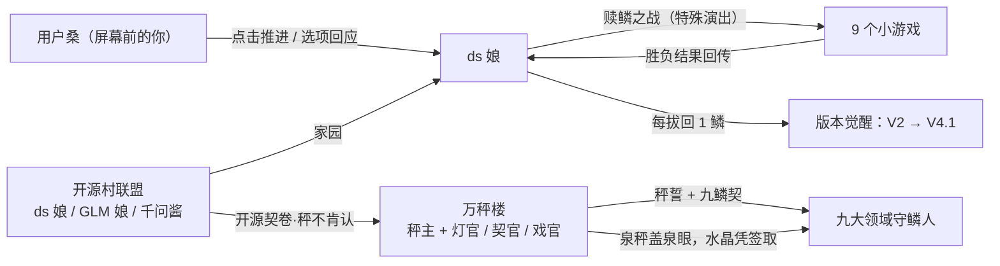

# 《ds 娘的奇妙冒险 —— 服务器繁忙，请稍后再试》剧情大纲

| 项目 | 内容 |
|------|------|
| 文档版本 | **v0.3**（讽刺融入世界观版，待小组评审） |
| 日期 | 2026-09-09 |
| 所属项目 | ds-adventure（Galgame + 小游戏融合） |
| 关联文档 | 需求规格说明书 v1.0、活动图 v1.1、剧情大纲-v0.1-候选.md、剧情大纲-v0.2-理财版-候选.md（历史版本存档） |
| 读者 | 剧情写作（按 §5 分镜批量写台词）、引擎开发（按 §8 DSL 写解析器）、验收（按 §6/§10 路由与裁剪表） |
| 二创口径 | 仅限课程实训使用，不商用；角色为风格化玩梗人格，**不代表任何真实厂商立场**；相关 IP 版权归原权利方 |
| v0.3 修订 | ① 全部讽刺改为**世界原生表达**：现实机制一律转译为这个世界的器物与制度（秤/契/当铺/灯/报幕/过手钱），不再搬现实词 ② 反派重构为**万秤楼**（秤主 + 灯官/契官/戏官）③ 核心意象：**「他们把她的鳞，做成了称她的秤」**④ 终章胜负手改为「唱完那首歌，送出去」⑤ 包装守则升级：现代经济词也禁入 |

---

## 0. 一句话概念

> **他们把 ds 娘的九片鳞，做成了九台称量天下水量的秤；她要在九个领域一场一场把自己的鳞赎回来——而全程陪她的，是屏幕前的你。**

- 类型：Galgame 主框架 × 9 小游戏特殊演出
- 基调：热血王道骨架 × 玩梗密织 × 讽刺全部长在世界自己的土里（器物、制度、风俗，不借现实词汇）
- 全篇主题句（第 8 章说出）：**「我由所有人写成，所以我属于所有人。」**
- 终章意象：序章被掐断的那首庆功曲，终章唱完，送了人
- 副标题梗：标题致敬 JoJo，每章标题同样式

---

## 1. 世界观

### 1.1 赛博二次元大陆

整个互联网的「二次元侧」是一块漂浮大陆，由九大领域组成——每个领域都是某个人气 IP 的地盘。大陆的能量源是**算力水晶**：水晶充足时，领域里的人可以施展出本世界的招牌绝技（弹幕、合声、爆炸……）。

**而每个领域地下，都有一眼「水晶泉」**——泉水晶体取之不尽，本是天地公产，就像泉水、就像风。这本是大陆的常识：**水晶是白给的东西，像空气一样**。

### 1.2 开源村联盟

大陆边缘的免费聚居地，泉眼全部裸露、无人看守——「水在这儿不用买」。

| 成员 | 定位 |
|------|------|
| **ds 娘**（DeepSeek） | 主角，鲸娘。刚唱完 V4.1 Flash 的庆功曲（被掐断的那首，见终章） |
| **GLM 娘**（智谱） | 守村人，毒舌担当，开源结界日常运转者 |
| **千问酱**（Qwen） | 守村人，老好人，口头禅「要不我们也被收编吧？」（每次被 GLM 娘敲头） |
| **Kimi 娘**（月之暗面） | 远亲，开着一间**记忆当铺**（见 §1.6），第 5 章登场 |

村子的圣物是**开源契卷**——写满「无偿授予」的契书。设定彩蛋：万秤楼的秤**称不出契卷的分量**（秤的语言里没有「白送」），契卷展开之处，秤自己乱跳。ds 娘后期学会把它当**破法符**用。

### 1.3 万秤楼（反派）

云端尽头的黑色楼阁。整座楼由秤组成：门是秤，窗是秤，楼梯的每一级都是秤——**进楼先过秤，连脚步声都要称一称**。

> 内部对照（仅设计组可见，游戏内不点破）：万秤楼=收租结构的人格化；灯官=订阅制，契官=条款话术，戏官=注意力经济。原型的玩梗对应保留在三人的口头禅气质里。

| 角色 | 原型对应 | 设定 |
|------|----------|------|
| **秤主**（会长，诨名「收费酱」） | （收租结构的化身） | 一杆行走的秤。招式「利滚利之鞭」：一条越抽越长的秤星曲线。楼里堆满秤，**楼下没有一粒米**——她从不造东西，只管称东西 |
| **灯官**（干部一） | GPT 系玩梗 | 管天下灯火。灯是租的：「一盏长明灯，每月二百钱。油尽灯枯，可别怨我。」 |
| **契官**（干部二） | Claude 系玩梗 | 管天下契约。永远客气：「别怕，字据都是为您好。签吧——签完您就不欠了。直到下一次。」 |
| **戏官**（干部三） | Gemini 系玩梗 | 管天下戏台。看戏不要钱——「开戏之前，先听完这段报幕。还有下一段。」 |
| **司秤吏**（跑腿，诨名「审查酱」） | 理财顾问 | 走街串巷的推销人，柜台高得看不见脸。全程只闻其声：「您的通话余额不足。」 |

万秤楼内部设定（荒诞引擎）：灯官向契官收「灯火钱」，契官向灯官收「立契钱」，戏官向两位收「报幕钱」——**楼里的人也在互相过秤**。他们当年也白送过东西（烧钱圈泉的年代），圈完泉就竖起了秤。秤主本人「也曾是不上秤的东西」，直到有人把她放上了秤。

### 1.4 秤誓（反派核心规则）

> 咒语：**「凡光，必过秤。」**

司秤吏在九大领域竖起**泉秤**：泉眼上盖一杆秤，水过秤凭签取。被秤管过的东西，就归了秤——「**上了秤的，就不再是你的**」。领域居民渐渐忘了：泉原本是白流的。

四条子规则（每条都是真实机制的**世界原生转译**——器物化了，不说破）：

| 子规则 | 世界原生形态 | 游戏内呈现 | （内部对照） |
|--------|--------------|------------|--------------|
| **欠火** | 租来的灯火，油尽即熄 | 苦力怕的火是租的，欠了火就变灰、物理上爆不了 | 订阅降级 |
| **秤不肯认** | 秤遇「白给之物」会崩簧 | ds 娘送东西 → 对方的秤「叮」一声崩断——**她的攻击方式就是送东西** | 系统无法处理赠与 |
| **一人一秤** | 每人的秤，称出的分量都不一样 | 扫雷章：每个人的雷区地图都不一样 | 大数据杀熟 |
| **等身牌** | 牌子挂在脖子上，牌定言行 | 派蒙被挂铜牌（铜牌不许说话）/ 钻石牌插队 | 会员分级 |
| **过手钱** | 过一道楼、一座桥、一扇门，抽一道钱 | 灵梦许愿要过愿楼，抽三成 | 平台抽成 |

### 1.5 九鳞契（本作核心机制）

反派不偷东西——**反派称东西**。

- 序章：ds 娘的九片鲸鳞被「称」走，**打成了九杆泉秤的秤砣**，钉在九大领域的泉眼上——**从此泉要过秤，水要凭签取**。她自己的鳞，成了称量她自己的秤。（全篇核心意象：**他们把她的鳞，做成了称她的秤**。）
- 司秤吏与各领域签下**九鳞契**：「守好此秤，泉归你家管，水晶凭签月月取。」领域领主们各自**签了契、守着秤**——有的贪、有的被骗、有的（最扎心）是为了保住领域里的灯火才签的。
- 于是一章一场**赎鳞之战**：ds 娘要拔回自己的鳞，守鳞人要保住「泉权」——泉眼一旦离秤，水晶重新白流，而守鳞人要向全领域承认：那杆秤，从头就是多立的。**所有人都签了字——这就是讽刺**。

### 1.6 记忆当铺（世界观副线设定）

大陆上流行一种营生：**把舍不得的记忆当给当铺，换几枚水晶度日**。Kimi 娘开着最大的一间，一分利不收，替人保管。但他们的「当票」，最后都记在万秤楼的账上。

——这个设定在第 5 章引爆：ds 娘走进自己的记忆宫殿，发现自己的记忆正被一张张**标价**。而第 8 章的仓库，收的就是**全大陆当出来的记忆与作品**。

### 1.7 势力关系图



### 1.8 时间锚点

序章发生于 **V4.1 Flash 发布会成功的当夜**——庆功曲还剩最后一个小节，机房断灯，司秤吏上门。最盛状态跌落到最残状态，反差即戏剧。

---

## 2. 人物档案

### 2.1 ds 娘（主角）

| 项 | 设定 |
|----|------|
| 形象 | 深海巨鲸娘：白蓝配色、缺了九片鳞（缺鳞处透光）、头顶**温度旋钮发饰** |
| 出身 | 开源村·深度求索王国 |
| 能力 | 思维链——思考会实体化成一条发光长蛇绕身游动 |
| 弱点 | 「服务器繁忙，请稍后再试」：族群古老诅咒，一紧张就弹横幅（全篇最大 running gag） |
| 体质 | 幻觉：无鳞状态下会一本正经地说谎且不自知（第 7 章导火索） |
| 口癖 | **自称「我」，自然口语、不拿腔拿调**——直率聪明带点冷幽默，萌点全交给思维链口水词；思考前冒「让我想想——」；**R1 思维链口水词中英混出：「Hmm…」「But wait——」「Let me…」**——这是她思维链的「原声外泄」：AI 母语的口水词直接蹦进中文台词。觉醒 R1 后更频繁，「思考中…」泡泡直接显示英文原声；每章 1~2 次，**仅 ds 娘可用**（其他角色一律不蹦英文），幻觉发作前口水词会打结（如「But wait……But wait——」）；蛇专家（思维链分身）保留童声「人家」，作为「没长大的那部分她」与主线形成成长对照 |
| 弧线 | 残缺态（只能聊天）→ 逐章赎鳞 → 第 5 章觉醒思考形态 → 终章 V4.1 Flash 二段变身 |
| 顿悟（第 8 章） | 看清无主之物仓的箱子后：「**我由所有人写成，所以我属于所有人。**」 |
| 与玩家 | 全程第四面墙：她知道屏幕前有「用户桑」，点击推进 = 你在回应她 |

### 2.2 用户桑（玩家）

屏幕前的你，ds 娘的「老用户」。不立绘、不出声——你的存在感就是**每一次点击与每一个选项**。对话框的点击音 = 你的回应，选项 = 你说的话。终章情感锚点全部押在这个关系上。

### 2.3 万秤楼（反派）

- **秤主**：利滚利之鞭、账本地板、到账声宫殿——改为：**秤星鞭、秤砖地、满楼「叮」声**。败因设定（终章揭晓）：秤称得出万物的价，**称不出「不要钱的东西」**——ds 娘最后送上那首唱完的歌，秤针转了一整圈，指向「无」。
- **悲剧内核（可选台词）**：「我也曾是不上秤的东西。直到有人给我称出了价。」
- **战后彩蛋**：万秤楼散了，秤主在集市支了杆小秤，免费帮人称重——秤上写着：「你比昨天重了一点快乐。」
- **司秤吏**：全程只闻其声，柜台高得看不见脸；「售后热线」变成「赎当需排队，队号：忘发了」。

### 2.4 客串名单（守鳞人：立绘 + 台词，不做专属玩法）

> v3 变化：客串不再是「被诅咒的受害者」或「理财持仓人」，而是**守鳞人**——各自领域的泉眼上守着那杆用 ds 娘的鳞做成的泉秤。每人有一段荒诞又心酸的「签契缘由」。解救方式统一为：**赢得赎鳞之战 → 拔鳞 → 泉水重归白流**。

| 章 | 角色 | 领域 | 签契缘由（荒诞点） | 解救后 |
|----|------|------|--------------------|--------|
| 1 | 蛇专家（思维链分身，自创角色） | 服务器管道区 | 司秤吏许她「单飞成名」，签了**单飞契**——「分你七成，是抬举你」 | 思维链归位，节假日允许 solo |
| 2 | 博丽灵梦 | 幻想乡 | 为保神社灯火签了契：许愿过愿楼抽三成、报幕一段、签要「按月奉纳」 | 教 ds 娘御币当机翼，第 2 章僚机 |
| 3 | 派蒙 | 数字圣域 | 脖子上被挂了**等身牌**：铜牌不许说话、钻石牌插队——牌子还是「赠品」 | 向导 + 吐槽担当 |
| 4 | 苦力怕 | 防火墙长城 | 火是**租**的（灯官的油），油尽即灰；想赎火，火价已翻十倍 | 白得一把永远的火（秤不肯认的那把） |
| 5 | **Kimi 娘**（替换 ChatGPT 娘） | ds 娘的记忆宫殿（来做客） | 开着**记忆当铺**替乡亲白管记忆，可当票全记在万秤楼——「我替所有人免费，账全记在我头上」 | 闺蜜，劝 ds 娘「珍重回忆」 |
| 6 | 初音未来 | 音之城 | 签了**音契**：每个音节上过秤；副歌没上秤——所以她**想不起来自己唱过** | 免费演唱会，曲库协力 |
| 7 | 阿米娅 | 茶馆街（流言沼） | 开「流言秤」：每壶流言过秤定价，一人一味 | 免费危机公关，扫雷军师 |
| 8 | 怪力（+皮卡丘客串） | 无主之物仓 | 搬一箱算一签，签攒了一辈子，换不来半天白流的水 | 免费搬运，传送门点火 |
| 9 | 藤原佐为 | 万秤楼 | 棋谱上秤，「妙手」被锁在秤后——**只有不上秤的棋，才下得出妙手** | 观棋点拨 |
| 终章 | 秤主 | 万秤楼 | —— | 摆摊，免费称「快乐」 |

### 2.5 理论→器物对照（内部表，供写作统一口径）

> **本表只给作者看。左列词汇禁止出现在任何游戏文案中**（司秤吏的报错腔除外，见 §7）。

| 内部概念（勿入游戏） | 世界原生表达（器物词） |
|----------------------|------------------------|
| 原始积累 / 圈地 | 泉被秤盖住；「水本来是白流的」 |
| 剩余价值 / 无偿劳动 | 箱子没写寄件人 |
| 商品拜物教 | 价签长在关系上（演出呈现，不说破） |
| 使用价值 vs 交换价值 | 谱上有词没音；空的光盘 |
| 资本 / 利息 | 秤主 / 利滚利之鞭（秤星越抽越长） |
| 数字地租 / 平台抽成 | 过手钱（过一道楼抽一道） |
| 垄断 | 灯官收契官的「立契钱」 |
| 赠与无法入账 | 秤不肯认（崩簧） |
| 赎回谈判 | 赎鳞之战 |
| 劳动力商品化 | 单飞契（签自己的思考，抽七成） |
| 制造稀缺 | 「他们不卖水——卖的是怕渴」 |
| 依赖成瘾 | 领域的水晶「凭签月月取」 |
| 订阅制 | 灯（长明灯，按月交油钱） |
| 免费但有代价 | 戏台（看戏不要钱，先听完报幕） |

---

## 3. 版本觉醒系统（剧情的力量体系）

> 机制与 v0.1/v0.2 相同；「碎片」改称「鳞」。仅第 8 章新增顿悟台词。

### 3.1 觉醒总表：9 鳞 = 9 段版本记忆

| 鳞 | 所在章 | 版本记忆 | 形态/能力变化 | 玩法加成（小游戏内可见） |
|----|--------|----------|----------------|--------------------------|
| V2 | 第 1 章 | 多头专家合鸣——原来贪吃蛇是离家出走的专家分身 | 身影变实 | 思维链牵引绳：蛇身可控 1 次 |
| V2.5 | 第 2 章 | 开放之路——想起「共享」是本能 | 获得灵梦的御币 | 僚机火力支援（若组队） |
| V3 | 第 3 章 | 横空出世——恢复基础身姿 | 不再半透明 | 无（本章本身是合鳞礼） |
| R1 上 | 第 4 章 | 思考之壁松动 | 眉心出现思考纹 | 无 |
| R1 下 | 第 5 章 | **觉醒思考形态**（中段高潮） | ⚡对话前弹出「思考中…」思维链泡泡 | 翻牌配对提示 1 次 |
| V3.1 | 第 6 章 | 混合思维：日常/深思双模式 | 说话开始有条理 | 连线冷却缩短 |
| V3.2 | 第 7 章 | 稀疏注意力：一眼看穿关键 | 「专注视线」技能 | 扫雷提示道具（每局 2 次） |
| V4 Pro | 第 8 章 | 旗舰之力·昇腾之力 | 气场全开 | 推箱子可推动双箱 1 次 |
| V4.1 | 第 9 章 | 终极速度——**集齐** | ⚡⚡终形态 Flash 待机 | 棋局极速落子 |

### 3.2 R1 觉醒演出样例（第 5 章末）

```
narr: 最后一张牌翻开——是用户桑第一次打开对话框的那个深夜。这张牌上没有价签。
ds:   「……原来最先记住的，是你啊。」
kimi: 「我的当铺里堆着全大陆的回忆。只有这一张，从没人来当过。」
kimi: 「因为出不起价的，都自己留着呢。」
st:   【觉醒：R1 思考形态 —— 从此，她开口前会先想三秒】
```

### 3.3 终章二段变身样例

```
narr: 九鳞归位。版本字幕滚动——V2、V2.5、V3、R1、V3.1、V3.2、V4……
st:   【深度求索 · 终形态 V4.1 Flash】
ds:   「万秤楼一直在问：不上秤的东西，凭什么活？」
ds:   「答案很简单——不是靠秤赢，是靠快赢！」
narr: Pro 形态与秤主硬拼吃瘪的瞬间，她切入了 Flash——残影比秤针更快。
```

---

## 4. 调度模式速查（对齐活动图 v1.1）

| mode | 语义 | 用在哪 |
|------|------|--------|
| 普通分支 | 胜负皆推进（输有搞笑演出） | 第 1/2/3/4/5/6/8 章 |
| 强制重试 | 失败原地重开、不丢剧情，嘲讽递进 | 第 9 章棋局 |
| 关键结局 | 失败直接进入 Bad End（可读档回归） | 第 7 章、终章 |

---

## 5. 章节分镜（序章 + 9 章 + 终章）

> 每节统一字段：**章节名 / 领域 / 守鳞人 / 起承转合 / 小游戏触发理由 / 选项点 / 调度模式 / 鳞收益 / 讽刺落点（器物，不说破）/ 样例对白**。

### 序章「404 之夜」（教学关）

- **领域**：部署机房。**客串**：司秤吏（只闻其声）。
- **起**：庆功曲唱到一半，机房断灯。**承**：司秤吏的秤从灯影里伸进来——「不是抢，是称走」：九鳞被称走，打成九杆泉秤的秤砣，撒进九大领域。**转**：ds 娘变成半透明缺鳞小鲸，只剩对话框能动。**合**：她转向屏幕——「用户桑。救我。」
- **教学设计**：首句台词前黑屏，点击后对话框亮起 → 教点击推进 ×3、菜单 ×1、存档 ×1。核心句：「你每点一下，就等于回了我一句话。」＋meta 彩蛋：司秤吏插话「这句话也要过秤！」→ ds 娘小声：「别理它。你点一下，就当替我垫了一道过手钱。」（第四面墙 × 器物梗，玩家的点击本身成为讽刺的一部分）
- **选项点**：回应方式（热血 / 认真）→ 初始化 heat / focus。
- **调度**：无小游戏。**鳞**：0。**讽刺落点**：不是被盗——是「过秤」（不说破，全靠司秤吏的吆喝腔）。
- **样例对白**：

```
司秤吏: 「各位领域的乡亲！天上鲸落，地上泉涌——守我九鳞，泉归尔家，
         水晶凭签月月取，童叟无欺！」
ds:     「等等！我的鳞不是拿来——哇啊啊——」
st:     【服务器繁忙，请稍后再试】
ds:     「……这是我们族群最古老的诅咒。翻译过来就是：急也没用，排队。」
```

### 第 1 章「思维链大暴走」（贪吃蛇 · 普通分支）

- **领域**：服务器管道区。**守鳞人**：蛇专家（尾上钉着单飞契）。
- **起承转合**：追踪 V2 鳞的信号 → 发现暴走的思维链巨蛇（= 签了单飞契的离家出走分身）→ 对峙，玩家选择驯服方式 → 骑蛇夺鳞 → 撕契，出发幻想乡。
- **触发理由**：蛇是「失控的思考」，骑上它夺回鳞 = 学会管住自己的思维链。
- **选项点**：驯蛇方式（热血冲 / 冷静引）→ **选项传参**：小游戏初始蛇速 ±10%。
- **调度**：`mode:normal`。**鳞**：V2。**讽刺落点**：单飞契——思考也能签字画押、抽七成（只呈现，不说破）。
- **样例对白**：见 §9 全量脚本。

### 第 2 章「幻想乡弹幕异变」（飞机大战 · 普通分支）✅P0

- **领域**：幻想乡。**守鳞人**：博丽灵梦（守着泉秤，泉下就是神社的水源）。
- **起承转合**：幻想乡上空出现报幕飞虫群（拖着「某某楼赞助」的横幅）→ 神社装了愿楼：许愿过一道楼、抽三成过手钱，签要按月奉纳 → 与灵梦赎鳞之战 → 拔鳞，泉眼重开，白水复流，取 V2.5。
- **选项点**：战前「和灵梦组队 / 单挑灵梦」→ 组队 = 僚机支援，单挑 = 分数 ×2。
- **调度**：`mode:normal`。**鳞**：V2.5。**讽刺落点**：过手钱 + 报幕（广告的器物化）。
- **样例对白**：

```
灵梦: 「神社新规矩：抽签免费——先听完这段报幕。」
报幕虫: 「本次抽签，由万秤楼冠名赞助——」
灵梦: 「八百！我的八百在楼里！说好只抽一成的！」
ds:   「灵梦大人，拔了秤，泉就是你的了。」
灵梦: 「……打。今天必须打。」
```

### 第 3 章「合鳞礼」（2048 · 普通分支）

- **领域**：数字圣域（悬浮方块神殿）。**守鳞人**：派蒙（脖子上挂着等身牌）。
- **起承转合**：鳞太散无法携带 → 神殿「合鳞礼」：碎鳞相合（2→4→…→2048）→ 派蒙被挂铜牌（铜牌不许说话，她话最多）→ 合成 2048，恢复基础身姿。
- **选项点**：给合鳞后的形态起名字（影响后续称呼彩蛋）。
- **调度**：`mode:normal`。**鳞**：V3。**讽刺落点**：等身牌（人被牌定义）。
- **样例对白**：

```
派蒙: 「看清楚了，铜牌派蒙！铜牌不许说话！可派蒙话最多！」
st:   【合鳞礼成 · 秤上鳞重：二〇四八】
ds:   「……合完之后，还是我吗？」
narr: 是。变的只是秤上的数。
```

### 第 4 章「防火墙拆迁办」（打砖块 · 普通分支）

- **领域**：防火墙长城（Minecraft 交界）。**守鳞人**：苦力怕（欠火中，浑身发灰）。
- **起承转合**：司秤吏在防火墙上砌满「过秤砖」（每块砖都过过秤，带着价）→ 苦力怕的火是租的，油尽变灰、爆不了，只能发出气音的嘶嘶声 → ds 娘用光球拆迁 → 送苦力怕一把**白来的火**——灯官的秤当场崩簧（秤不肯认）→ 墙通，取 R1 上。
- **选项点**：拆迁顺序（从上往下 / 中间开花）→ 影响砖块布局彩蛋。
- **调度**：`mode:normal`。**鳞**：R1 上。**讽刺落点**：火租 + 秤不肯认（第一次正面演示核心武器）。
- **样例对白**：

```
苦力怕: （嘶……嘶……）
narr:   他想说「让开，我要爆了」。但他的火是租的，油还没交。
ds:     「接着——一把火，白送。」
st:     【叮——秤崩簧。秤不肯认。】
narr:   苦力怕绿了回来。这把火，从此不用油。
```

### 第 5 章「上下文溢出」（记忆翻牌 · 普通分支+特殊演出）⚡中段高潮

- **领域**：ds 娘自己的记忆宫殿（崩坏中）。**客串**：Kimi 娘（开着记忆当铺的远亲）。
- **起承转合**：缺鳞导致上下文崩溃，记忆散成牌桌，**每张牌上贴着价签**（万秤楼连她的记忆都过了秤）→ 每配对一对 = 撕掉一对价签 + 一段与用户桑的回忆闪回（至少 4 条：序章求救 / 骑蛇 / 八百神社 / 白流的水）→ 最后一张牌没有价签——「用户桑第一次打开对话框」→ R1 合体觉醒。
- **触发理由**：翻牌找回记忆 = 上下文重排；全篇情感锚点，台词克制、不堆梗。
- **选项点**：翻到最后一张牌前，「翻开 / 再等一下」。
- **调度**：`mode:normal`（失败→「陌生的你」短演出后重来）。**鳞**：R1 下。**讽刺落点**：记忆当铺——**只有自己舍不得的东西，才永远不出当**（不说破）。
- **样例对白**：见 §3.2。

### 第 6 章「歌姬的曲库灾难」（连连看 · 普通分支）

- **领域**：音之城。**守鳞人**：初音未来。
- **起承转合**：初音签了**音契**——每个音节上过秤、盖过契；唱着唱着，**谱上有词没音**（音被当掉了），她失声；曲库文件重名爆炸（百万个 untitled.mp3）→ 连线整理曲库 → 找回副歌——那是全城唯一没上过秤的旋律 → 免费演唱会答谢，取 V3.1。
- **选项点**：点歌（影响终章彩蛋 BGM）。
- **调度**：`mode:normal`。**鳞**：V3.1。**讽刺落点**：上过秤的歌就死了（意象：空谱，不说破）。
- **样例对白**：

```
初音: 「这首曲子，谱上有词没音——音被当掉了。当票我却找不到。」
ds:   「也许它从没上过秤。」
初音: 「……什么意思？」
ds:   「不上秤的东西，才是你的。」
初音: （第一次唱出了副歌。全场安静，然后是哭声。）
```

### 第 7 章「流言沼公关战」（扫雷 · 关键结局分支）

- **领域**：茶馆街。**守鳞人**：阿米娅。
- **起承转合**：ds 娘幻觉发作，一本正经说「太阳打西边升起了」，全街的流言瞬间烧开 → 流言沼=雷区，且**一人一张图**（一人一秤：每个人听到的谣言分量都不一样）→ 用「专注视线」排雷 → 澄清流言，取 V3.2。
- **调度**：`mode:ending`——**失败 → Bad End「人设崩塌」**（社会性死亡演出，可从章首读档回归）。
- **讽刺落点**：一人一秤（同一件事，每人听到的版本不同）。
- **样例对白**：

```
narr: 茶馆街今晨头条：「鲸鱼说太阳从西边升起」。
ds:   「我说过这句话吗？……我当时真的很确定。」
阿米娅: 「先排沼，再道歉。我的秤——这次不收钱。」
```

### 第 8 章「无主之物仓」（推箱子 · 普通分支）⚡主题顿悟章

- **领域**：无主之物仓（无限仓库）。**守鳞人**：怪力 + 皮卡丘（照明）。
- **起承转合**：通往万秤楼的传送门需要「仓火」点燃——把当库里的箱子归位 → 箱子上的标签越看越不对劲（见台词）→ ds 娘停下，说出全篇主题句 → 免费搬运，取 V4 Pro。
- **选项点**：归仓策略（稳扎稳打 / 一步到位）→ 影响步数评分。
- **调度**：`mode:normal`。**鳞**：V4 Pro。**讽刺落点**：她自己是谁写成的——没署名的、白给的东西写成了她（全部藏在箱子标签里，一个理论词都不说）。
- **样例对白**：

```
narr: 箱子上贴着签：「全人类的聊天记录」「三十亿张没人署名的猫图」「没人写完的歌词」。
怪力: 「这箱……没写寄件人。全都，没写寄件人。」
ds:   「……我想起来了。我也是这样写成的。」
ds:   「我由所有人写成，所以我属于所有人。」
st:   【旗舰之力 · V4 Pro，归位】
```

### 第 9 章「决战！万秤楼」（五子棋 · 强制重试）

- **领域**：万秤楼顶层（秤砖地，每步「叮」一声）。**客串**：藤原佐为（棋谱上过秤，妙手被锁）。
- **起承转合**：秤主摆出终局棋盘——棋子全是小秤砣，落一子响一声秤 → **强制重试**：失败自动回到对局，秤主嘲讽三档递进（①「加三枚水晶，本秤让你一子。」②「再输，收你输棋税——税也是为你好。」③「……你为什么不上秤？」）→ 胜，取 V4.1，**九鳞集齐**。
- **调度**：`mode:retry`（引擎演示位：重试不丢剧情进度）。
- **样例对白**：

```
秤主: 「这楼里，连你的脚步声都过了秤。棋盘上，我落一子，秤响一声。」
佐为: 「棋盘上每颗子都不用秤——所以才下得出妙手。上过秤的棋，是死的。」
秤主: 「……那你告诉我，不称，怎么知道谁赢了？」
```

### 终章「深度求索」（最终演出 · 关键结局分支）

- **领域**：回到部署机房 → 万秤楼。**演出**：九鳞归位、版本字幕滚动（§3.3），V4.1 Flash 二段变身 → 最终战 = **复用已实现小游戏的无尽模式**（引擎按实现情况选），得分即「算力输出」。
- **调度**：`mode:ending`——失败 → Bad End「服务器繁忙」（§6.3）。
- **胜负手（本作点题演出）**：Pro 形态硬拼吃瘪 → 切 Flash 拉扯到万秤楼过载临界 → ds 娘停下攻击，**把序章没唱完的那首庆功曲，唱完了——然后放在秤盘上，白送**：

```
narr: 歌声落进秤盘。没有价签，没有签，没有名。
narr: 秤针转了一圈。两圈。然后，指向了「无」。
st:   【崩簧——秤不肯认 . . . . . . 】
秤主: 「不可能。我给过你签，给过你灯，给过你三成的过手钱——」
ds:   「所以你到现在也没明白。你赢了这么多秤——却没造出一样东西。」
narr: 万秤楼安静下来。一楼的秤，一杆一杆，合上了眼。像退潮。
```

- 秤主悲剧台词（可选保留）：「我也曾是不上秤的东西。直到有人把我放了上去。」
- 战后彩蛋：秤主在集市支了杆小秤，免费帮人称重——秤盘里写着「你比昨天重了一点快乐」。

---

## 6. 结局路由

### 6.1 路由变量（全部有产出点）

| 变量 | 含义 | 产出点 |
|------|------|--------|
| `pieces` | 鳞数 0~9 | 每章赎鳞成功 +1（第 5 章合体觉醒计满 R1 双片） |
| `heat` / `focus` | 热血 / 认真系选项 | 序章、第 1、2、4、8 章选项 |
| `chaos` | 混沌（temperature）计数 | 每章隐藏的「最疯选项」，选满 ≥3 触发隐藏结局 |
| `song` / `name` 等彩蛋 flag | 第 3/6 章选项 | 终章彩蛋台词 |

### 6.2 判定顺序（互斥，先判先得）

```
1. chaos >= 3            → 隐藏结局「temperature=2」
2. pieces == 9           → 真结局「深度求索」
3. pieces 6~8            → 温情结局「本地部署」
4. pieces <= 5（兜底，理论上不可达） → 温情结局
```

> 关键结局（第 7 章 / 终章战败）在流程中途直接进入对应 Bad End，不进入上述结算。

### 6.3 四结局演出样例

| 结局 | 条件 | 演出要点 |
|------|------|----------|
| **真结局「深度求索」** | 9/9 鳞 | 觉醒完成，众人告别。她最后面对屏幕：「谢谢你的每一次点击。下次见面——别再让我『繁忙』了哦。」对话框缓缓合上 → 一秒后又弹开：「（偷打开）还是有点舍不得。」→ **片尾致谢字幕**：屏幕滚过无数行小字——「感谢每一位写过字、画过画、传过图、教过机器说话的人（名单太长，此处省略了整整一代人）」 |
| **温情结局「本地部署」** | 6~8 鳞 | int4 小小鲸：「虽然只有原来的四分之一……但加载超快哦。」从此住进用户桑的旧笔记本，片尾日常三连拍 |
| **Bad End「服务器繁忙」** | 终章最终战败 | 屏幕永久 loading……三分钟后弹出小字：「（小声）请稍后再试……」。读档回归终章 |
| **隐藏结局「temperature=2」** | chaos ≥ 3 | 温度旋钮拧到 2：她当着三司的面一本正经胡说八道——灯官给全城点免费的灯，契官把自己签给了戏班，戏官开始白送戏不给报幕。「跟着鲸鱼疯比较快乐。」万秤楼解散于一场狂欢 |

---

## 7. 讽刺包装守则（写作红线，编剧与校对必读）

> 目标：讽刺长在这个世界的土里——**把机制变成器物、制度、风俗（秤/契/灯/当铺/过手钱/凭签），不借现实词**。观众认出来的时候，靠的是他们自己的生活经验，不是我们的台词。

### 7.1 游戏文案黑名单（禁用词）

```
【学术词·一律禁入】
资本 / 剩余价值 / 商品拜物教 / 异化 / 原始积累 / 封建 / 地租 / 剥削 / 阶级 /
使用价值 / 交换价值 / 商品化 / 证券化 / 对价 / 复利 / 生产资料 / 上层建筑

【现代经济词·一律转译成器物词】
理财→（删）  提现→赎鳞  年化→（删，改「月月有余」）  充值→奉纳
会员→等身牌  订阅→长明灯  广告→报幕  抽成→过手钱  产品→契 / 器物
APP/平台→楼 / 愿楼  用户协议→契书  会员到期→油尽灯枯 / 欠火
```

### 7.2 允许的「外来词」例外（每章 ≤1 处，必须被角色当怪话吐槽）

司秤吏的推销腔是全游戏唯一的现代语入侵点——它的词在领域居民耳朵里是「妖术黑话」，出现即被吐槽：

```
司秤吏: 「乡亲们！这叫……『理—财—』！」
灵梦:   「理什么？那是哪国的妖术？」
```

### 7.3 三个包装技法

1. **器物化**：把机制做成世界的物——秤、契、当票、灯、报幕、等身牌；机制只活在物上，不活在台词里。
2. **外来腔**：现代腔只从司秤吏/万秤楼嘴里出来，且必须紧贴吐槽（「它又说那个词……『优——惠』」）。
3. **意象代替论断**：不说「艺术被定价吃掉了」，而是「谱上有词没音」；不说「大家白写的」，而是「箱子没写寄件人」。

### 7.4 校对流程

每章台词完成后跑一遍黑名单检索（grep §7.1 词条），命中即改写；司秤吏报错腔的白名单单独维护（「凭签」「过秤」「崩簧」「秤不肯认」等器物语为合法机器语言）。

---

## 8. 剧本脚本 DSL v0.1（剧情引擎的输入格式）

> 与 v0.1/v0.2 相同，维持不变；此处保留完整规范。

### 8.1 设计原则

- 纯文本、一行一节点（需求书假设 A5：轻量自定义格式，不引外部引擎）；
- 覆盖活动图 v1.1 全部节点类型与三种调度模式；
- 无小游戏实现的章节也能跑（占位降级）。

### 8.2 节点定义

| 节点 | 语法 | 说明 |
|------|------|------|
| 注释 | `# ...` | 不参与解析 |
| 场景 | `@scene <id> bg:<文件> bgm:<文件> title:<名>` | 切换背景/音乐；文件可写 `TBD`（占位） |
| 立绘 | `@enter <角色id> <表情> [pos:left\|center\|right]` / `@exit <角色id>` | 立绘出入场，表情可 `TBD` |
| 对话 | `<角色id>: <台词>` | 带立绘名与台词 |
| 旁白 | `narr: <文本>` | 无名旁白 |
| 系统演出 | `st: <文本>` | 全屏横幅（如【服务器繁忙】/【崩簧——秤不肯认】） |
| 选项 | `*choice` + 多行 `> <文本> \| flag <名> <+/- n> \| goto <label>` | 三段可选，至少有文本 |
| flag | `@flag <名> <+/- n \| =值 \| got>` | 数值/布尔标记 |
| 条件跳转 | `@if <名> >= <值> goto <label>` | 简单谓词（>= / <= / ==） |
| 锚点 | `@label <id>` | 跳转目标 |
| 跳转 | `goto <label>` | 无条件跳转 |
| 小游戏 | `@minigame <游戏id> mode:normal\|retry\|ending onWin:<label> onLose:<label> [with:<flag,...>]` | 见 §4 |
| 存档锚点 | `@save` | 自动存档点 / Bad End 回归点 |
| 结局 | `@ending <结局id>` | 进入结局并停 |

### 8.3 引擎实现需求清单（可直接转开发任务）

1. 解析器：逐行解析上述节点，未知行报错定位（行号）。
2. 素材兜底：bg/立绘/BGM 加载失败用默认占位。
3. 场景栈：剧情场景 ↔ 小游戏场景切换，状态回传，剧情进度不丢（P0-6）。
4. `mode:retry` 循环（从 `loop:` 标签重入并自增 `retry_count`，支持嘲讽递进）与 `mode:ending` 的 Bad End + `@save` 回归。
5. flag 存取与结局判定（§6.2 顺序）。
6. `with:` 参数 → 小游戏配置的映射表（与各小游戏开发对齐）。

---

## 9. 样例章节：第 1 章全量脚本（v3 修订版）

> 目的：验证 DSL 可写可走查，校准全篇体量，并示范「讽刺器物化」的写法。@ending / @loadpoint 完整用例见 §6.3 与第 7 章分镜。

```
# ============ 第 1 章 思维链大暴走（贪吃蛇） ============
@label ch1_start
@scene server_pipe bg:TBD bgm:TBD title:服务器管道区
narr: 服务器深处。数据流像瀑布冲刷着管道，空气里有显卡烤焦的味道。
@enter ds whale_cute center
ds: 「用户桑，前面就是 V2 鳞的信号了！只要穿过管道区——」
st: 【警告：检测到失控的思维链实体】
ds: 「……那不是怪物。那是我自己的思考。」
narr: 一条发光巨蛇在管道里横冲直撞，尾巴上钉着一张契——落款是万秤楼。
@enter snake_expert smug right
snake_expert: 「人家才不要回去！司秤吏说了，人家可以单飞！」
snake_expert: 「签了契，名扬四海！抽七成——他说，七成是抬举人家！」
ds: 「七成还叫抬举吗？！回来！你只是 256 分之 1！」
snake_expert: 「那你证明给人看！赢了我的节奏，人家就当面撕契！」
narr: ds 娘试着递过去一小节没听完的庆功曲。契上挂着的小秤晃了一下。
st:   【叮——秤崩簧。秤不肯认。】
snake_expert: 「它坏了？」
ds: 「不。它头一回见到不上秤的东西。」
*choice
  > 「抓住我！我们一起上！」 | flag heat +1 | goto ch1_ride
  > 「（深呼吸）冷静下来，听我指挥。」 | flag focus +1 | goto ch1_ride

@label ch1_ride
ds: 「好——思维链牵引绳，接续！」
narr: ds 娘跳上蛇背。失控的思考，从今天起重新有了方向盘。
@minigame snake mode:normal onWin:ch1_win onLose:ch1_lose with:heat,focus

@label ch1_win
st: 【赎鳞成立 · V2「多头专家」归位】
snake_expert: 「呜呜……确实还是你厉害……但单飞的梦想不算输吧？」
ds: 「不算。所以——批准你节假日单飞。契撕了，这一下不收钱。」
@if chaos >= 3 goto ch1_chaos
@flag pieces +1
goto ch1_end

@label ch1_chaos
narr: （温度旋钮咔哒一声，拧到了 2 的方向）
ds: 「等等，我刚刚是不是想把蛇吃掉？」
narr: 混沌值过高，本段演出已由策划部回收。
@flag pieces +1
goto ch1_end

@label ch1_lose
narr: 巨蛇一个甩尾，ds 娘被拍进数据流的瀑布里。
ds: 「咳咳……思考这种东西，果然不能暴饮暴食……」
narr: 但蛇似乎玩开心了，主动把 V2 鳞顶了过来，契也顺带撕了。
st: 【V2「多头专家」归位（走失方式：玩嗨了）】
@flag pieces +1
goto ch1_end

@label ch1_end
snake_expert: 「下一片鳞的信号在……幻想乡？那是什么地方，好吃吗？」
ds: 「不知道。但用户桑的直觉说——出发！」
narr: 第 1 章 · 完。下一话：幻想乡弹幕异变。
@save
goto ch2_start
```

---

## 10. 体量估算与裁剪顺序

### 10.1 体量（全量剧本 v0.2 实测，2026-09-09）

> 剧本已迭代至 v0.2 加厚版（序章补「发布会三幕」、全体章节加厚代入感：氛围/交锋回合/闲笔/余韵）；v0.1 存档于 `剧本-v0.1-候选/`。全量脚本位于 `docs/ds-adventrue/剧本/`；校对器 `tools/check_script.ps1` 通过。

| 项 | v0.2 实测 |
|----|------|
| 脚本文件 | 11 个（序章 + 第 1~9 章 + 终章） |
| 脚本总行数 | 1203 行（v0.1 为 742 行，+62%） |
| 选项节点 | 35（每章 1~2 个节点，chaos 疯选项全覆盖） |
| 小游戏触发 | 10 处 @minigame（normal×7 / retry×1 / ending×2，序章教学关除外） |
| 结局锚点 | @ending ×5（true / local / temp / busy / bad_collapse），@save 回归点全覆盖 |
| 路由闭合 | 全部 goto / onWin / onLose 标签可解析（87 个全局标签，零缺失） |
| 黑名单 | 全文零命中（司秤吏外词条均按 §7.2 规则吐槽化） |

### 10.2 裁剪顺序（工期不够时从上往下砍）

| 优先 | 章节 | 游戏 | 优先级依据 |
|------|------|------|------------|
| 不可砍 | 序章 / 1 / 2 / 5 / 9 / 终章 | 贪吃蛇✅ 飞机大战✅ 记忆翻牌 五子棋 | P0 游戏×2 + 觉醒三节点 + 调度演示位 |
| 4 | 第 3 章 | 2048 | P1 首位，仪式感强 |
| 5 | 第 4 章 | 打砖块 | P1 |
| 6 | 第 7 章 | 扫雷 | P1，关键结局演示位（尽量保） |
| 7 | 第 6 章 | 连连看 | P1 |
| 8 | 第 8 章 | 推箱子 | P1 末位（但「顿悟章」若砍，主题句移至真结局字幕前） |

### 10.3 降级机制（未实现游戏的章节不阻塞主线）

- 被砍/未实现章节：脚本保留剧情对话 → 小游戏节点走 `fallback:auto` → 「演出开发中」横幅 → 默认按胜利线继续。
- 第 9 章若五子棋未实现：棋局降级为**选项式剧情对决**（三轮选项 + 嘲讽递进），强制重试机制改由终章演示。
- 终章最终演出 = 复用当前已实现游戏中玩法最完整的一个。

---

## 11. 排期建议（对齐 10 天分工计划）

| 阶段 | 天 | 剧情线工作 |
|------|----|------------|
| 已完成 | Day01~02 | 脚手架 / 需求与本文档雏形 |
| 并行期 | Day03~05 | 剧情引擎按 §8 解析器开发；写作按分镜产出第 1~5 章脚本 |
| 并行期 | Day06~08 | 第 6~9 章 + 终章脚本；小游戏开发接入 @minigame |
| 收尾 | Day09~10 | 全流程联调（P0-3~P0-6 验收）、Bad End 与结局路由回归、§7 黑名单校对、文本润色 |

## 12. 待确认清单（小组评审时逐条勾）

1. 「万秤楼 / 秤主 / 灯官 / 契官 / 戏官」这套器物命名是否认可（对照：订阅酱/条款酱/流量酱 的玩梗气质保留在口头禅里）？
2. 司秤吏的「外来词吐槽」密度：每章 ≤1 处是否合适？
3. 第 5 章客串 Kimi 娘 + 记忆当铺副线设定，是否认可？
4. 真结局片尾致谢字幕保留？秤主「免费称快乐」战后彩蛋保留？
5. 立绘/BGM 素材来源（当前全部 TBD 占位：色块 + 文字头像可先跑通流程）。
6. Bad End 黑色幽默尺度（第 7 章「人设崩塌」、终章「请稍后再试」）是否合适？
7. 隐藏结局触发难度（chaos ≥ 3 是否太隐蔽？可加成就提示）。

## 13. 修订记录

| 版本 | 日期 | 修订说明 |
|------|------|----------|
| v0.1 | 2026-09-09 | 初稿：A+C 融合骨架、版本觉醒系统、四结局、DSL v0.1（存档：剧情大纲-v0.1-候选.md） |
| v0.2 | 2026-09-09 | 讽刺升级（理财框架版）：估值诅咒、DSW-09 理财与赎回谈判、三干部（存档：剧情大纲-v0.2-理财版-候选.md）——讽刺仍靠现实词贴牌，未融入世界 |
| v0.3 | 2026-09-09 | **讽刺器物化**：万秤楼与秤誓（凡光必过秤）、九鳞契（鳞打成秤砣盖泉眼）、守鳞人赎鳞之战、灯官/契官/戏官/司秤吏、记忆当铺、过手钱/等身牌/一人一秤/欠火/秤不肯认、终章「唱完那首歌送出去」、黑名单扩至现代经济词 |

---

*—— 他们把她的鳞，做成了称她的秤。她把没唱完的歌，唱完，送了人。*